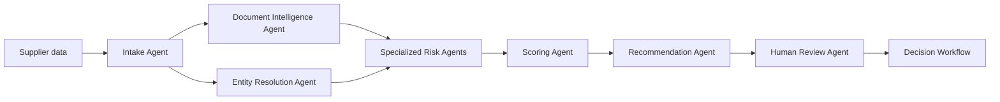

# Agentic AI Architecture

## Design Principle

Use specialized agents with clear responsibilities instead of one generic agent. Agents should produce structured outputs with confidence, source attribution, and evidence references.

## Agent Catalog

| Agent | Responsibility |
|---|---|
| Intake Agent | Reads onboarding forms, supplier emails, spreadsheets, uploaded documents, and API payloads |
| Document Intelligence Agent | Performs OCR, document classification, extraction, and summarization |
| Entity Resolution Agent | Resolves legal names, aliases, branches, parent companies, subsidiaries, directors, and UBOs |
| Sanctions and Compliance Agent | Screens sanctions, watchlists, regulatory notices, legal filings, and policy violations |
| Financial Risk Agent | Reviews filings, financial distress indicators, bankruptcy signals, credit data, and payment risk |
| ESG Risk Agent | Extracts ESG controversies, sustainability claims, labor issues, and environmental risk |
| News and Reputation Agent | Monitors news, social/web signals, sentiment shifts, and controversy velocity |
| Logistics Risk Agent | Reviews shipment delays, route disruptions, trade exposure, and geography risk |
| Authenticity Agent | Detects tampered documents, fake certificates, metadata inconsistencies, reused templates, and suspicious signatures |
| Anomaly Agent | Flags unusual onboarding, document, transaction, ownership, or behavioral patterns |
| Scoring Agent | Converts extracted signals into explainable category and composite risk scores |
| Recommendation Agent | Recommends approve, reject, review, or mitigation actions |
| Human Review Agent | Prepares analyst review packets and decision summaries |
| Monitoring Agent | Continuously monitors onboarded suppliers for risk changes |
| Notification Agent | Sends alerts, creates cases, and routes events to owners |

## Agent Workflow



## Agent Output Contract

Each agent should return structured output:

```json
{
  "supplier_id": "SUP-001",
  "risk_category": "compliance",
  "signal": "Supplier found in adverse regulatory notice",
  "severity": "high",
  "confidence": 0.91,
  "source": {
    "name": "Regulatory notice database",
    "url": "https://example.com/source",
    "retrieved_at": "2026-05-11T10:00:00Z"
  },
  "evidence_summary": "The supplier appears in a regulatory notice related to non-compliance.",
  "recommended_action": "Route to risk analyst for review"
}
```

## Guardrails

- Require source attribution for material risk findings.
- Separate extracted facts from model interpretation.
- Maintain confidence scores for extracted data.
- Do not allow AI-only final rejection or approval.
- Log all agent outputs and human overrides.
- Use deterministic scoring rules for final score calculation wherever possible.
