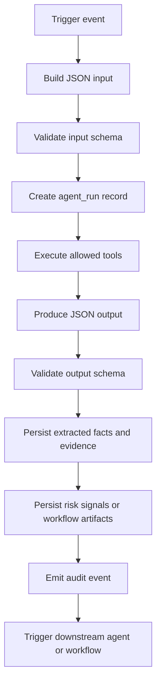

# Agents Workflow Low-Level Design

## Objective

This document defines production-ready low-level design instructions for the agent layer of the supplier risk intelligence platform. It converts the high-level agent catalog into concrete execution contracts, tool usage, persistence behavior, and operational guardrails.

The design supports the MVP pre-onboarding workflow first, while keeping the agent contracts extensible for continuous monitoring, authenticity checks, anomaly detection, predictive analytics, and enterprise integrations.

## Design Principles

- Use specialized agents with narrow responsibilities.
- Require JSON schema validation for every agent input and output.
- Separate extracted facts from model interpretation.
- Require source attribution for all material risk findings.
- Persist every material output before downstream scoring or decisioning.
- Keep final scoring deterministic and reproducible from stored signals and scoring policy.
- Do not allow any AI agent to make final approve, reject, suspend, or critical risk acceptance decisions.
- Log all agent runs, tool calls, failures, retries, and human overrides.
- Treat external data as untrusted until normalized, attributed, and confidence-scored.

## Runtime Model

Agents should run through a shared execution framework rather than direct ad hoc calls from UI or API handlers.

### Recommended Components

| Component | Responsibility |
|---|---|
| Agent Orchestrator | Starts agent runs, passes normalized context, enforces dependencies, validates outputs |
| Tool Registry | Defines allowed API, database, file, object storage, OCR, web, and model tools per agent |
| Schema Validator | Validates JSON input and output contracts |
| Agent Run Store | Persists run status, timing, model/tool metadata, and errors |
| Evidence Store | Persists external sources, document references, snapshots, and credibility metadata |
| Risk Signal Store | Persists normalized risk findings used by scoring |
| Audit Service | Records user, system, document, score, recommendation, and decision events |
| Policy Engine | Holds deterministic scoring rules, thresholds, weights, and routing policies |
| Notification Service | Sends alerts after workflow, score, case, or decision events |

### Standard Agent Run Lifecycle



## Shared JSON Types

These objects are reused in agent inputs and outputs.

### Agent Context

```json
{
  "tenant_id": "TEN-001",
  "correlation_id": "corr_01HXZ8X8Z3",
  "initiated_by": {
    "user_id": "USR-001",
    "role": "Risk Analyst"
  },
  "workflow": {
    "workflow_type": "pre_onboarding",
    "onboarding_request_id": "ONB-001",
    "run_reason": "initial_assessment"
  },
  "execution": {
    "agent_run_id": "RUN-001",
    "requested_at": "2026-05-14T10:00:00Z",
    "idempotency_key": "ONB-001:initial_assessment:v1"
  }
}
```

### Supplier Snapshot

```json
{
  "supplier_id": "SUP-001",
  "legal_name": "Acme Components Private Limited",
  "trade_names": ["Acme Components"],
  "country": "IN",
  "tax_id": "29ABCDE1234F1Z5",
  "registration_number": "U12345MH2020PTC123456",
  "website": "https://www.example-supplier.com",
  "addresses": [
    {
      "type": "registered",
      "line1": "Unit 10, Industrial Estate",
      "city": "Mumbai",
      "region": "Maharashtra",
      "postal_code": "400001",
      "country": "IN"
    }
  ],
  "contacts": [
    {
      "name": "Priya Sharma",
      "email": "priya@example-supplier.com",
      "phone": "+91-9000000000",
      "role": "Supplier Admin"
    }
  ],
  "business_metadata": {
    "industry": "Electronic Components",
    "commodity_category": "Semiconductors",
    "supplier_tier": "Tier 2",
    "annual_spend_estimate": 2500000,
    "currency": "USD"
  }
}
```

### Document Reference

```json
{
  "document_id": "DOC-001",
  "document_version_id": "DOCV-001",
  "supplier_id": "SUP-001",
  "document_type": "business_registration",
  "file_name": "certificate.pdf",
  "mime_type": "application/pdf",
  "storage_key": "tenants/TEN-001/suppliers/SUP-001/documents/DOC-001/v1.pdf",
  "uploaded_at": "2026-05-14T09:30:00Z",
  "uploaded_by": "USR-002",
  "checksum_sha256": "7af4f3c0..."
}
```

### Evidence Source

```json
{
  "evidence_source_id": "EVD-001",
  "source_type": "external_api",
  "name": "Sanctions Provider",
  "url": "https://provider.example/api/screening/SUP-001",
  "retrieved_at": "2026-05-14T10:01:00Z",
  "credibility_score": 0.95,
  "snapshot_storage_key": "evidence/TEN-001/SUP-001/EVD-001.json"
}
```

### Risk Signal

```json
{
  "risk_signal_id": "RSK-001",
  "supplier_id": "SUP-001",
  "category": "compliance",
  "signal": "Potential sanctions watchlist name match",
  "severity": "high",
  "confidence": 0.88,
  "extracted_facts": [
    {
      "field": "matched_name",
      "value": "Acme Components Ltd",
      "confidence": 0.91,
      "source_ref": "EVD-001"
    }
  ],
  "interpretation": "The supplier name closely matches an entity in a sanctions screening result and requires compliance review.",
  "evidence_source_ids": ["EVD-001"],
  "recommended_action": "Route to compliance officer for review"
}
```

### Tool Call Record

```json
{
  "tool_call_id": "TOOL-001",
  "tool_name": "sanctions_provider.screen",
  "tool_type": "external_api",
  "request_ref": "redacted_request_payload_ref",
  "response_ref": "evidence/TEN-001/SUP-001/tool-responses/TOOL-001.json",
  "status": "succeeded",
  "started_at": "2026-05-14T10:00:10Z",
  "completed_at": "2026-05-14T10:00:12Z",
  "error": null
}
```

## Common Output Envelope

All agents should return the following top-level envelope.

```json
{
  "agent_run_id": "RUN-001",
  "agent_name": "Sanctions and Compliance Agent",
  "status": "succeeded",
  "supplier_id": "SUP-001",
  "started_at": "2026-05-14T10:00:00Z",
  "completed_at": "2026-05-14T10:01:00Z",
  "confidence": 0.9,
  "tool_calls": [],
  "evidence_sources": [],
  "extracted_facts": [],
  "risk_signals": [],
  "warnings": [],
  "errors": [],
  "next_actions": []
}
```

Allowed `status` values:

```json
["succeeded", "partially_succeeded", "failed", "skipped", "requires_human_review"]
```

Allowed `severity` values:

```json
["low", "medium", "high", "critical"]
```

Allowed `risk_category` values:

```json
["compliance", "financial", "esg", "cyber", "operational", "reputation", "logistics", "authenticity", "entity", "anomaly"]
```

## Agent Orchestration Sequence

### MVP Pre-Onboarding Sequence

1. Intake Agent
2. Document Intelligence Agent
3. Entity Resolution Agent
4. Sanctions and Compliance Agent
5. Financial Risk Agent
6. News and Reputation Agent
7. Scoring Agent
8. Recommendation Agent
9. Human Review Agent
10. Notification Agent

### Post-Onboarding Monitoring Sequence

1. Monitoring Agent
2. Specialized Risk Agents based on event type
3. Entity Resolution Agent when identity or ownership changes are detected
4. Scoring Agent
5. Recommendation Agent
6. Human Review Agent or Case Management workflow
7. Notification Agent

## Agent Specifications

## 1. Intake Agent

### Purpose

Normalize supplier-submitted forms, buyer-provided onboarding details, emails, spreadsheets, and API payloads into a canonical supplier snapshot.

### Trigger

- Onboarding request created.
- Supplier intake form submitted.
- Supplier profile updated.
- Clarification response received.

### Input JSON

```json
{
  "context": {},
  "onboarding_request_id": "ONB-001",
  "supplier_id": "SUP-001",
  "input_sources": [
    {
      "source_type": "form",
      "source_id": "FORM-001",
      "payload": {
        "legal_name": "Acme Components Private Limited",
        "country": "IN",
        "tax_id": "29ABCDE1234F1Z5",
        "website": "https://www.example-supplier.com"
      }
    },
    {
      "source_type": "api_payload",
      "source_id": "ERP-REQ-001",
      "payload_ref": "object-storage://intake/ERP-REQ-001.json"
    }
  ],
  "existing_supplier_snapshot": {}
}
```

### Output JSON

```json
{
  "agent_run_id": "RUN-INTAKE-001",
  "agent_name": "Intake Agent",
  "status": "succeeded",
  "supplier_id": "SUP-001",
  "normalized_supplier": {},
  "field_confidence": [
    {
      "field": "legal_name",
      "value": "Acme Components Private Limited",
      "confidence": 0.98,
      "source_type": "form",
      "source_id": "FORM-001"
    }
  ],
  "missing_fields": [
    {
      "field": "registration_number",
      "required": true,
      "recommended_action": "request_clarification"
    }
  ],
  "data_quality_warnings": [
    {
      "field": "website",
      "warning": "Website domain does not match contact email domain",
      "severity": "medium"
    }
  ],
  "next_actions": [
    {
      "action": "persist_supplier_snapshot",
      "target": "suppliers"
    }
  ]
}
```

### Tools

| Tool | Type | Usage |
|---|---|---|
| `db.suppliers.get` | DB read | Load current supplier profile |
| `db.onboarding_requests.get` | DB read | Load request context and status |
| `object_storage.get_json` | Storage read | Load submitted API or spreadsheet payloads |
| `validation.normalize_company_profile` | Internal utility | Normalize names, addresses, tax IDs, country codes |
| `audit.log_event` | Internal API | Log normalization results and profile changes |

### Persistence

- Update `suppliers`.
- Update `supplier_contacts`.
- Create `audit_events`.
- Create clarification candidates when required fields are missing.

### Production Notes

- Do not overwrite high-confidence verified fields with lower-confidence submitted values.
- Store before and after snapshots for material profile changes.
- Use idempotency key per onboarding request and form version.

## 2. Document Intelligence Agent

### Purpose

Classify uploaded documents, run OCR or document extraction, identify key fields, summarize document contents, and flag missing or low-confidence extraction results.

### Trigger

- New document uploaded.
- Document version replaced.
- Manual extraction requested.
- Scheduled retry for failed extraction.

### Input JSON

```json
{
  "context": {},
  "supplier": {},
  "documents": [
    {
      "document_id": "DOC-001",
      "document_version_id": "DOCV-001",
      "document_type": "business_registration",
      "storage_key": "tenants/TEN-001/suppliers/SUP-001/documents/DOC-001/v1.pdf",
      "mime_type": "application/pdf",
      "checksum_sha256": "7af4f3c0..."
    }
  ],
  "extraction_requirements": [
    "legal_name",
    "registration_number",
    "registered_address",
    "issue_date",
    "expiry_date"
  ]
}
```

### Output JSON

```json
{
  "agent_run_id": "RUN-DOC-001",
  "agent_name": "Document Intelligence Agent",
  "status": "succeeded",
  "supplier_id": "SUP-001",
  "document_results": [
    {
      "document_id": "DOC-001",
      "document_version_id": "DOCV-001",
      "detected_document_type": "business_registration",
      "classification_confidence": 0.96,
      "language": "en",
      "extracted_fields": [
        {
          "field_name": "legal_name",
          "value": "Acme Components Private Limited",
          "confidence": 0.97,
          "source_location": {
            "page": 1,
            "bounding_box": [0.12, 0.18, 0.62, 0.24]
          }
        }
      ],
      "summary": "The document appears to be a business registration certificate for Acme Components Private Limited.",
      "warnings": []
    }
  ],
  "next_actions": [
    {
      "action": "persist_extracted_fields",
      "target": "extracted_fields"
    }
  ]
}
```

### Tools

| Tool | Type | Usage |
|---|---|---|
| `db.documents.get` | DB read | Load document metadata |
| `object_storage.get_file` | Storage read | Fetch raw document bytes |
| `ocr.provider.extract` | External API | Run OCR or structured extraction |
| `document.classifier.classify` | Internal or model tool | Identify document type |
| `llm.structured_extract` | Model call | Extract normalized fields from OCR text |
| `db.extraction_jobs.update` | DB write | Track job status |
| `audit.log_event` | Internal API | Log extraction completion or failure |

### Persistence

- Create or update `extraction_jobs`.
- Insert `extracted_fields`.
- Update `documents.status`.
- Store OCR text and extraction payloads in object storage.
- Create `audit_events`.

### Production Notes

- Preserve raw OCR output for audit and reprocessing.
- Mask or redact sensitive fields in logs.
- Failed OCR should be visible and retryable.
- Low-confidence fields should route to clarification rather than silently passing downstream.

## 3. Entity Resolution Agent

### Purpose

Resolve supplier identity, aliases, branches, parent companies, subsidiaries, directors, beneficial owners, and relationship hints from submitted data, documents, and external sources.

### Trigger

- Intake normalization completed.
- Document extraction completed.
- Ownership, director, address, or registration fields changed.
- Monitoring detects entity-change event.

### Input JSON

```json
{
  "context": {},
  "supplier": {},
  "extracted_fields": [
    {
      "document_id": "DOC-001",
      "field_name": "legal_name",
      "value": "Acme Components Private Limited",
      "confidence": 0.97
    }
  ],
  "candidate_sources": [
    "internal_suppliers",
    "company_registry",
    "sanctions_aliases",
    "news_entities"
  ]
}
```

### Output JSON

```json
{
  "agent_run_id": "RUN-ENTITY-001",
  "agent_name": "Entity Resolution Agent",
  "status": "succeeded",
  "supplier_id": "SUP-001",
  "entity_matches": [
    {
      "match_type": "legal_entity",
      "matched_name": "Acme Components Private Limited",
      "matched_identifier": "U12345MH2020PTC123456",
      "confidence": 0.94,
      "match_factors": ["legal_name", "registration_number", "country"],
      "evidence_source_id": "EVD-REG-001"
    }
  ],
  "relationships": [
    {
      "relationship_type": "director",
      "source_entity": "SUP-001",
      "target_name": "Amit Mehta",
      "target_identifier": null,
      "confidence": 0.82,
      "evidence_source_id": "EVD-REG-001"
    }
  ],
  "risk_signals": [],
  "next_actions": [
    {
      "action": "persist_entity_matches",
      "target": "entity_matches"
    }
  ]
}
```

### Tools

| Tool | Type | Usage |
|---|---|---|
| `db.suppliers.search` | DB read | Find existing suppliers with similar identifiers |
| `db.extracted_fields.list` | DB read | Load verified extracted fields |
| `company_registry.lookup` | External API | Validate legal entity and registration data |
| `entity_matcher.score` | Internal utility | Compute fuzzy and deterministic match scores |
| `web_search.query` | Web search | Find public aliases or corporate relationship hints when configured |
| `db.entity_matches.insert` | DB write | Persist candidate matches |
| `audit.log_event` | Internal API | Log material identity findings |

### Persistence

- Insert `entity_matches`.
- Insert relationship records in SQLite relationship tables for MVP.
- Create `evidence_sources`.
- Create `risk_signals` for suspicious identity mismatches.
- Create `audit_events`.

### Production Notes

- Require deterministic identifiers where available before auto-linking entities.
- Treat fuzzy-only matches as candidate matches requiring analyst review.
- Avoid merging supplier records automatically without authorized human confirmation.

## 4. Sanctions and Compliance Agent

### Purpose

Screen supplier, aliases, directors, UBOs, addresses, and related entities against sanctions, watchlists, regulatory notices, policy exclusions, and legal compliance sources.

### Trigger

- Entity resolution completed.
- Supplier submitted for assessment.
- Monitoring refresh scheduled.
- New related entity discovered.

### Input JSON

```json
{
  "context": {},
  "supplier": {},
  "entities_to_screen": [
    {
      "entity_type": "supplier",
      "name": "Acme Components Private Limited",
      "country": "IN",
      "identifiers": {
        "tax_id": "29ABCDE1234F1Z5",
        "registration_number": "U12345MH2020PTC123456"
      }
    },
    {
      "entity_type": "director",
      "name": "Amit Mehta",
      "country": "IN",
      "identifiers": {}
    }
  ],
  "screening_policy": {
    "include_sanctions": true,
    "include_watchlists": true,
    "include_regulatory_notices": true,
    "include_litigation": true
  }
}
```

### Output JSON

```json
{
  "agent_run_id": "RUN-COMP-001",
  "agent_name": "Sanctions and Compliance Agent",
  "status": "requires_human_review",
  "supplier_id": "SUP-001",
  "screening_results": [
    {
      "screened_entity_name": "Acme Components Private Limited",
      "result_type": "watchlist_candidate",
      "matched_name": "Acme Components Ltd",
      "list_name": "Example Watchlist",
      "match_score": 0.88,
      "severity": "high",
      "confidence": 0.86,
      "evidence_source_id": "EVD-COMP-001"
    }
  ],
  "risk_signals": [
    {
      "category": "compliance",
      "signal": "Potential watchlist match",
      "severity": "high",
      "confidence": 0.86,
      "evidence_source_ids": ["EVD-COMP-001"],
      "recommended_action": "Route to compliance officer for review"
    }
  ],
  "next_actions": [
    {
      "action": "route_review",
      "owner_role": "Compliance Officer"
    }
  ]
}
```

### Tools

| Tool | Type | Usage |
|---|---|---|
| `sanctions_provider.screen` | External API | Screen entities against sanctions and watchlists |
| `regulatory_notices.search` | External API | Search regulatory actions and notices |
| `legal_filings.search` | External API | Search litigation or court records where available |
| `policy_exclusions.evaluate` | Internal API | Check internal blocked countries, commodities, and entities |
| `db.evidence_sources.insert` | DB write | Persist source metadata |
| `db.risk_signals.insert` | DB write | Persist compliance risk findings |
| `audit.log_event` | Internal API | Log screening results |

### Persistence

- Insert `evidence_sources`.
- Insert `risk_signals`.
- Store provider response snapshots in object storage.
- Create review routing records where needed.
- Create `audit_events`.

### Production Notes

- Never auto-reject based only on AI interpretation.
- Critical or high candidate matches require compliance review.
- Store provider version, list version, timestamp, and search parameters for audit.

## 5. Financial Risk Agent

### Purpose

Assess financial distress indicators, bankruptcy signals, credit weakness, payment risk, adverse filings, and financial stability.

### Trigger

- Supplier assessment reaches enrichment stage.
- Financial documents are extracted.
- Monitoring detects financial event.
- Manual refresh requested by finance analyst.

### Input JSON

```json
{
  "context": {},
  "supplier": {},
  "financial_documents": [
    {
      "document_id": "DOC-FIN-001",
      "document_type": "financial_statement",
      "extracted_fields": [
        {
          "field_name": "revenue",
          "value": "12500000",
          "confidence": 0.91
        }
      ]
    }
  ],
  "financial_policy": {
    "include_credit_data": true,
    "include_bankruptcy_search": true,
    "include_payment_history": true
  }
}
```

### Output JSON

```json
{
  "agent_run_id": "RUN-FIN-001",
  "agent_name": "Financial Risk Agent",
  "status": "succeeded",
  "supplier_id": "SUP-001",
  "financial_indicators": [
    {
      "indicator": "credit_score",
      "value": "B",
      "severity": "medium",
      "confidence": 0.82,
      "evidence_source_id": "EVD-FIN-001"
    }
  ],
  "risk_signals": [
    {
      "category": "financial",
      "signal": "Moderate credit risk based on available credit data",
      "severity": "medium",
      "confidence": 0.82,
      "evidence_source_ids": ["EVD-FIN-001"],
      "recommended_action": "Route to finance analyst if composite score exceeds review threshold"
    }
  ]
}
```

### Tools

| Tool | Type | Usage |
|---|---|---|
| `db.extracted_fields.list` | DB read | Load financial document extractions |
| `credit_provider.lookup` | External API | Retrieve credit score or payment risk data |
| `bankruptcy_records.search` | External API | Search bankruptcy or insolvency indicators |
| `financial_ratio_calculator.compute` | Internal utility | Compute ratios from extracted statements |
| `web_search.query` | Web search | Search public financial distress indicators when configured |
| `db.risk_signals.insert` | DB write | Persist financial findings |
| `audit.log_event` | Internal API | Log financial assessment completion |

### Persistence

- Insert `evidence_sources`.
- Insert `risk_signals`.
- Store external financial response snapshots.
- Create `audit_events`.

### Production Notes

- Mark unavailable financial data explicitly instead of assuming low risk.
- Keep provider-derived scores separate from internally calculated indicators.
- Do not expose sensitive financial documents to users without permissions.

## 6. ESG Risk Agent

### Purpose

Identify sustainability, labor, environmental, governance, human rights, and ethical sourcing risk signals.

### Trigger

- ESG enrichment configured for supplier category or geography.
- ESG-related document uploaded.
- Monitoring detects ESG controversy.
- Analyst manually requests ESG review.

### Input JSON

```json
{
  "context": {},
  "supplier": {},
  "esg_documents": [
    {
      "document_id": "DOC-ESG-001",
      "document_type": "sustainability_certificate"
    }
  ],
  "monitoring_window": {
    "from": "2025-05-14",
    "to": "2026-05-14"
  },
  "esg_policy": {
    "include_labor": true,
    "include_environment": true,
    "include_governance": true
  }
}
```

### Output JSON

```json
{
  "agent_run_id": "RUN-ESG-001",
  "agent_name": "ESG Risk Agent",
  "status": "succeeded",
  "supplier_id": "SUP-001",
  "esg_findings": [
    {
      "topic": "labor",
      "finding": "No material labor controversies found in configured sources",
      "severity": "low",
      "confidence": 0.72,
      "evidence_source_id": "EVD-ESG-001"
    }
  ],
  "risk_signals": []
}
```

### Tools

| Tool | Type | Usage |
|---|---|---|
| `esg_provider.search` | External API | Search ESG ratings and controversy datasets |
| `news_provider.search` | External API | Search ESG-related adverse media |
| `web_search.query` | Web search | Search public reports and NGO sources when configured |
| `db.documents.list` | DB read | Load ESG certificates and policies |
| `db.risk_signals.insert` | DB write | Persist ESG findings |
| `audit.log_event` | Internal API | Log ESG assessment |

### Persistence

- Insert `evidence_sources`.
- Insert `risk_signals` for material ESG issues.
- Store snapshots of source results.
- Create `audit_events`.

### Production Notes

- Avoid treating absence of public ESG controversy as verified compliance.
- Track source coverage by geography and language.
- Route material ESG concerns to ESG Analyst.

## 7. News and Reputation Agent

### Purpose

Monitor adverse media, controversy velocity, reputational events, sentiment shifts, and public web signals related to the supplier and related entities.

### Trigger

- Initial risk enrichment.
- Scheduled monitoring cycle.
- Significant external news event detected.
- Manual analyst refresh.

### Input JSON

```json
{
  "context": {},
  "supplier": {},
  "search_entities": [
    {
      "name": "Acme Components Private Limited",
      "type": "supplier",
      "country": "IN"
    }
  ],
  "search_policy": {
    "lookback_days": 365,
    "include_adverse_keywords": true,
    "include_sentiment": true,
    "max_results": 50
  }
}
```

### Output JSON

```json
{
  "agent_run_id": "RUN-NEWS-001",
  "agent_name": "News and Reputation Agent",
  "status": "succeeded",
  "supplier_id": "SUP-001",
  "media_findings": [
    {
      "title": "Supplier mentioned in regulatory inspection article",
      "url": "https://news.example/article-001",
      "published_at": "2026-04-20T00:00:00Z",
      "sentiment": "negative",
      "severity": "medium",
      "confidence": 0.78,
      "evidence_source_id": "EVD-NEWS-001"
    }
  ],
  "risk_signals": [
    {
      "category": "reputation",
      "signal": "Negative media mention related to regulatory inspection",
      "severity": "medium",
      "confidence": 0.78,
      "evidence_source_ids": ["EVD-NEWS-001"],
      "recommended_action": "Include in analyst review packet"
    }
  ]
}
```

### Tools

| Tool | Type | Usage |
|---|---|---|
| `news_provider.search` | External API | Search licensed or configured news sources |
| `web_search.query` | Web search | Search public web sources when allowed |
| `sentiment.classify` | Model or internal utility | Classify article sentiment and topic |
| `dedupe.simhash` | Internal utility | Deduplicate repeated media articles |
| `db.evidence_sources.insert` | DB write | Persist article metadata |
| `db.risk_signals.insert` | DB write | Persist reputation findings |

### Persistence

- Insert `evidence_sources`.
- Insert `risk_signals`.
- Store article snippets or snapshots according to licensing and retention policy.
- Create `audit_events`.

### Production Notes

- Respect source licensing and copyright restrictions.
- Deduplicate syndicated articles.
- Use entity disambiguation before assigning media findings to supplier.

## 8. Logistics Risk Agent

### Purpose

Assess shipment delays, route disruptions, trade exposure, geographic instability, port congestion, and supplier operational continuity risks.

### Trigger

- Supplier category requires logistics assessment.
- Shipment, route, or geography data changes.
- Monitoring detects supply-chain disruption.
- Manual supplier relationship manager review.

### Input JSON

```json
{
  "context": {},
  "supplier": {},
  "logistics_profile": {
    "origin_countries": ["IN"],
    "destination_countries": ["US"],
    "ports": ["INBOM", "USLAX"],
    "transport_modes": ["ocean", "air"],
    "critical_materials": ["semiconductor components"]
  },
  "monitoring_window": {
    "from": "2026-04-14",
    "to": "2026-05-14"
  }
}
```

### Output JSON

```json
{
  "agent_run_id": "RUN-LOG-001",
  "agent_name": "Logistics Risk Agent",
  "status": "succeeded",
  "supplier_id": "SUP-001",
  "logistics_findings": [
    {
      "finding": "Moderate route disruption risk on configured origin-destination lane",
      "route": "INBOM-USLAX",
      "severity": "medium",
      "confidence": 0.74,
      "evidence_source_id": "EVD-LOG-001"
    }
  ],
  "risk_signals": [
    {
      "category": "logistics",
      "signal": "Moderate route disruption risk",
      "severity": "medium",
      "confidence": 0.74,
      "evidence_source_ids": ["EVD-LOG-001"],
      "recommended_action": "Notify supplier relationship manager if supplier is critical"
    }
  ]
}
```

### Tools

| Tool | Type | Usage |
|---|---|---|
| `trade_data_provider.lookup` | External API | Retrieve trade exposure or shipment indicators |
| `route_risk_provider.lookup` | External API | Retrieve port, route, or region disruption data |
| `geopolitical_risk_provider.lookup` | External API | Retrieve region-level disruption signals |
| `db.suppliers.get_logistics_profile` | DB read | Load route and category data |
| `db.risk_signals.insert` | DB write | Persist logistics risk findings |
| `audit.log_event` | Internal API | Log logistics assessment |

### Persistence

- Insert `evidence_sources`.
- Insert `risk_signals`.
- Create monitoring events when material changes occur.
- Create `audit_events`.

### Production Notes

- Treat logistics risk as category-specific; not every supplier requires the same checks.
- Preserve source timestamp because route conditions can change quickly.

## 9. Authenticity Agent

### Purpose

Detect document tampering, fake certificates, inconsistent metadata, reused templates, suspicious signatures, stamps, logos, and cross-source inconsistencies.

### Trigger

- Document extraction completed.
- High-value or high-risk supplier submitted.
- Compliance or analyst manually requests authenticity check.
- Document version replaced.

### Input JSON

```json
{
  "context": {},
  "supplier": {},
  "documents": [
    {
      "document_id": "DOC-001",
      "document_version_id": "DOCV-001",
      "document_type": "business_registration",
      "storage_key": "tenants/TEN-001/suppliers/SUP-001/documents/DOC-001/v1.pdf",
      "checksum_sha256": "7af4f3c0..."
    }
  ],
  "checks": {
    "metadata_consistency": true,
    "visual_tampering": true,
    "certificate_verification": true,
    "cross_source_verification": true
  }
}
```

### Output JSON

```json
{
  "agent_run_id": "RUN-AUTH-001",
  "agent_name": "Authenticity Agent",
  "status": "requires_human_review",
  "supplier_id": "SUP-001",
  "authenticity_findings": [
    {
      "document_id": "DOC-001",
      "finding_type": "metadata_inconsistency",
      "finding": "PDF creation date is later than stated certificate issue date by 312 days",
      "severity": "high",
      "confidence": 0.87,
      "evidence_source_id": "EVD-AUTH-001"
    }
  ],
  "risk_signals": [
    {
      "category": "authenticity",
      "signal": "Potential document metadata inconsistency",
      "severity": "high",
      "confidence": 0.87,
      "evidence_source_ids": ["EVD-AUTH-001"],
      "recommended_action": "Pause onboarding and request analyst review"
    }
  ]
}
```

### Tools

| Tool | Type | Usage |
|---|---|---|
| `object_storage.get_file` | Storage read | Load original document |
| `document_metadata.extract` | Internal utility | Extract PDF/image metadata |
| `image_forensics.analyze` | Internal or external API | Detect tampering, copy-move patterns, signature anomalies |
| `certificate_registry.verify` | External API | Verify certificate IDs where available |
| `db.extracted_fields.list` | DB read | Compare document claims against extracted fields |
| `company_registry.lookup` | External API | Cross-check registration details |
| `db.risk_signals.insert` | DB write | Persist authenticity risk signals |

### Persistence

- Insert authenticity findings.
- Insert `risk_signals`.
- Store forensic result snapshots.
- Update document authenticity status.
- Create `audit_events`.

### Production Notes

- Use authenticity findings as review triggers, not automatic fraud conclusions.
- Preserve original uploaded file immutably.
- Do not modify source documents during analysis.

## 10. Anomaly Agent

### Purpose

Detect unusual onboarding, document, transaction, ownership, contact, payment, shipment, or behavioral patterns compared with historical supplier behavior and peer groups.

### Trigger

- Supplier submitted for assessment.
- Profile or document changes occur after submission.
- Monitoring detects unusual event.
- Batch anomaly scan runs.

### Input JSON

```json
{
  "context": {},
  "supplier": {},
  "events": [
    {
      "event_type": "document_replacement",
      "entity_id": "DOC-001",
      "occurred_at": "2026-05-14T09:45:00Z",
      "metadata": {
        "replacement_count": 3
      }
    }
  ],
  "peer_group": {
    "country": "IN",
    "industry": "Electronic Components",
    "supplier_tier": "Tier 2"
  }
}
```

### Output JSON

```json
{
  "agent_run_id": "RUN-ANOM-001",
  "agent_name": "Anomaly Agent",
  "status": "succeeded",
  "supplier_id": "SUP-001",
  "anomalies": [
    {
      "anomaly_type": "document_replacement_frequency",
      "description": "Document replacement count is higher than peer-group baseline",
      "baseline": "p95=1 replacement per onboarding request",
      "observed": "3 replacements",
      "severity": "medium",
      "confidence": 0.8,
      "evidence_source_id": "EVD-ANOM-001"
    }
  ],
  "risk_signals": [
    {
      "category": "anomaly",
      "signal": "Unusual document replacement frequency",
      "severity": "medium",
      "confidence": 0.8,
      "evidence_source_ids": ["EVD-ANOM-001"],
      "recommended_action": "Include in risk analyst review"
    }
  ]
}
```

### Tools

| Tool | Type | Usage |
|---|---|---|
| `db.audit_events.query` | DB read | Load supplier behavior history |
| `db.suppliers.peer_group_stats` | DB read | Load baseline metrics |
| `anomaly_rules.evaluate` | Internal utility | Apply deterministic anomaly rules |
| `anomaly_model.score` | Model or ML service | Score statistical deviations when available |
| `db.risk_signals.insert` | DB write | Persist anomaly findings |
| `audit.log_event` | Internal API | Log anomaly assessment |

### Persistence

- Insert anomaly findings.
- Insert `risk_signals`.
- Store peer baseline snapshot.
- Create `audit_events`.

### Production Notes

- Make deterministic anomaly rules visible and configurable.
- Keep peer-group baseline versioned for reproducibility.
- Allow analysts to dismiss anomaly findings with reason.

## 11. Scoring Agent

### Purpose

Convert persisted risk signals into deterministic category scores, composite score, risk level, score components, and score history.

### Trigger

- Required enrichment agents complete.
- Risk signal inserted or updated.
- Manual score recalculation requested.
- Monitoring detects material risk event.

### Input JSON

```json
{
  "context": {},
  "supplier_id": "SUP-001",
  "onboarding_request_id": "ONB-001",
  "risk_signals": [
    {
      "risk_signal_id": "RSK-001",
      "category": "compliance",
      "severity": "high",
      "confidence": 0.86,
      "evidence_source_ids": ["EVD-COMP-001"]
    }
  ],
  "scoring_policy": {
    "policy_id": "POLICY-001",
    "version": "2026.05.01",
    "category_weights": {
      "compliance": 0.25,
      "financial": 0.15,
      "esg": 0.15,
      "cyber": 0.1,
      "operational": 0.1,
      "reputation": 0.1,
      "logistics": 0.05,
      "authenticity": 0.1
    },
    "thresholds": {
      "low": [0, 39],
      "medium": [40, 69],
      "high": [70, 84],
      "critical": [85, 100]
    }
  }
}
```

### Output JSON

```json
{
  "agent_run_id": "RUN-SCORE-001",
  "agent_name": "Scoring Agent",
  "status": "succeeded",
  "supplier_id": "SUP-001",
  "risk_score": {
    "risk_score_id": "SCORE-001",
    "policy_id": "POLICY-001",
    "policy_version": "2026.05.01",
    "composite_score": 67,
    "risk_level": "medium",
    "calculated_at": "2026-05-14T10:08:00Z"
  },
  "category_scores": [
    {
      "category": "compliance",
      "score": 78,
      "risk_level": "high",
      "contributing_signal_ids": ["RSK-001"]
    }
  ],
  "score_components": [
    {
      "category": "compliance",
      "signal_id": "RSK-001",
      "component_score": 78,
      "weight": 0.25,
      "explanation": "High-severity compliance candidate match with 0.86 confidence"
    }
  ],
  "next_actions": [
    {
      "action": "generate_recommendation",
      "target_agent": "Recommendation Agent"
    }
  ]
}
```

### Tools

| Tool | Type | Usage |
|---|---|---|
| `db.risk_signals.list` | DB read | Load current risk signals |
| `db.scoring_policy.get_active` | DB read | Load active scoring rules |
| `policy_engine.calculate_score` | Internal utility | Calculate deterministic scores |
| `db.risk_scores.insert` | DB write | Persist score header |
| `db.score_components.insert` | DB write | Persist explainable components |
| `audit.log_event` | Internal API | Log score calculation |

### Persistence

- Insert `risk_scores`.
- Insert `score_components`.
- Preserve score history.
- Create `audit_events`.

### Production Notes

- No non-deterministic LLM output should determine final numeric scores.
- Store policy version with every score.
- Recalculation should be reproducible from stored risk signals and policy rules.

## 12. Recommendation Agent

### Purpose

Generate an evidence-backed recommendation such as approve candidate, human review, enhanced due diligence, request information, or reject/block recommendation. The output is advisory only.

### Trigger

- Scoring completed.
- Score override submitted.
- New critical risk signal added.
- Analyst requests updated recommendation.

### Input JSON

```json
{
  "context": {},
  "supplier": {},
  "risk_score": {
    "risk_score_id": "SCORE-001",
    "composite_score": 67,
    "risk_level": "medium"
  },
  "category_scores": [],
  "risk_signals": [],
  "missing_requirements": [
    {
      "requirement": "business_registration",
      "status": "complete"
    }
  ],
  "recommendation_policy": {
    "allow_ai_final_decision": false,
    "medium_requires_human_review": true,
    "critical_requires_approver": true
  }
}
```

### Output JSON

```json
{
  "agent_run_id": "RUN-REC-001",
  "agent_name": "Recommendation Agent",
  "status": "succeeded",
  "supplier_id": "SUP-001",
  "recommendation": {
    "recommendation_id": "REC-001",
    "recommended_action": "human_review",
    "recommended_owner_role": "Risk Analyst",
    "summary": "Supplier is medium risk due to compliance and reputation findings. Human review is required before final onboarding decision.",
    "rationale": [
      {
        "reason": "Composite score is in medium risk range",
        "evidence_refs": ["SCORE-001"]
      },
      {
        "reason": "Compliance signal requires analyst validation",
        "evidence_refs": ["RSK-001", "EVD-COMP-001"]
      }
    ],
    "constraints": [
      "AI recommendation is advisory only",
      "Final decision must be made by authorized human approver"
    ]
  },
  "next_actions": [
    {
      "action": "prepare_human_review_packet",
      "target_agent": "Human Review Agent"
    }
  ]
}
```

### Tools

| Tool | Type | Usage |
|---|---|---|
| `db.risk_scores.latest` | DB read | Load latest score |
| `db.risk_signals.list` | DB read | Load material findings |
| `db.documents.checklist_status` | DB read | Load missing/expired documents |
| `recommendation_policy.evaluate` | Internal utility | Map score, signals, and policy to advisory action |
| `llm.evidence_summary` | Model call | Produce concise evidence-backed rationale |
| `db.recommendations.insert` | DB write | Persist recommendation |
| `audit.log_event` | Internal API | Log recommendation generation |

### Persistence

- Insert `recommendations`.
- Create `audit_events`.

### Production Notes

- Include evidence references for every material recommendation reason.
- Use constrained output schema and allowed action enum.
- Never produce a final decision record.

Allowed `recommended_action` values:

```json
[
  "recommend_onboarding",
  "human_review",
  "enhanced_due_diligence",
  "request_information",
  "reject_or_block_recommendation"
]
```

## 13. Human Review Agent

### Purpose

Prepare analyst review packets, decision summaries, evidence bundles, and role-specific review tasks for human users.

### Trigger

- Recommendation generated.
- Supplier reaches review queue.
- New evidence requires review.
- Clarification response received.

### Input JSON

```json
{
  "context": {},
  "supplier": {},
  "recommendation_id": "REC-001",
  "risk_score_id": "SCORE-001",
  "review_policy": {
    "required_roles": ["Risk Analyst"],
    "route_compliance_findings_to": "Compliance Officer",
    "route_financial_findings_to": "Finance Analyst"
  }
}
```

### Output JSON

```json
{
  "agent_run_id": "RUN-REVIEW-001",
  "agent_name": "Human Review Agent",
  "status": "succeeded",
  "supplier_id": "SUP-001",
  "review_packet": {
    "review_packet_id": "REVP-001",
    "summary": "Medium-risk supplier requiring analyst review before onboarding.",
    "assigned_roles": ["Risk Analyst", "Compliance Officer"],
    "priority": "medium",
    "sections": [
      {
        "section": "compliance",
        "summary": "Potential watchlist candidate match requires validation.",
        "evidence_refs": ["RSK-001", "EVD-COMP-001"],
        "required_action": "validate_or_dismiss"
      }
    ],
    "available_decisions": [
      "approve",
      "reject",
      "defer",
      "request_information",
      "enhanced_due_diligence"
    ]
  },
  "next_actions": [
    {
      "action": "create_review_queue_item",
      "owner_role": "Risk Analyst"
    }
  ]
}
```

### Tools

| Tool | Type | Usage |
|---|---|---|
| `db.recommendations.get` | DB read | Load recommendation |
| `db.risk_scores.get` | DB read | Load score and components |
| `db.risk_signals.list` | DB read | Load evidence-backed findings |
| `db.documents.list` | DB read | Load document status |
| `review_router.assign` | Internal utility | Determine role assignments and priority |
| `db.review_queue.insert` | DB write | Create review task |
| `audit.log_event` | Internal API | Log review packet creation |

### Persistence

- Insert review queue item.
- Persist review packet or generated summary.
- Create role-specific tasks if task table exists.
- Create `audit_events`.

### Production Notes

- Keep review packets factual and evidence-linked.
- Show AI interpretation separately from extracted facts.
- Do not hide unresolved warnings or failed agent runs from reviewers.

## 14. Monitoring Agent

### Purpose

Continuously monitor onboarded suppliers for material risk changes and trigger enrichment refreshes, score recalculations, cases, and notifications.

### Trigger

- Scheduled monitoring cadence.
- External event stream message.
- Webhook from provider.
- Manual monitoring refresh.

### Input JSON

```json
{
  "context": {},
  "supplier_id": "SUP-001",
  "monitoring_subscription": {
    "subscription_id": "MON-001",
    "enabled": true,
    "cadence": "daily",
    "watched_categories": ["compliance", "financial", "reputation", "esg"],
    "thresholds": {
      "score_delta": 10,
      "critical_signal": true
    }
  },
  "last_successful_run_at": "2026-05-13T10:00:00Z"
}
```

### Output JSON

```json
{
  "agent_run_id": "RUN-MON-001",
  "agent_name": "Monitoring Agent",
  "status": "succeeded",
  "supplier_id": "SUP-001",
  "detected_events": [
    {
      "risk_event_id": "EVT-001",
      "event_type": "negative_news_spike",
      "category": "reputation",
      "severity": "medium",
      "detected_at": "2026-05-14T10:00:00Z",
      "evidence_source_id": "EVD-NEWS-101"
    }
  ],
  "refresh_plan": [
    {
      "target_agent": "News and Reputation Agent",
      "reason": "negative_news_spike"
    },
    {
      "target_agent": "Scoring Agent",
      "reason": "material_event_detected"
    }
  ]
}
```

### Tools

| Tool | Type | Usage |
|---|---|---|
| `db.monitoring_subscriptions.list_due` | DB read | Load due monitoring jobs |
| `event_stream.consume` | Stream read | Consume external/internal risk events |
| `provider_delta.check` | External API | Check changed records since last run |
| `db.risk_events.insert` | DB write | Persist detected risk events |
| `workflow.enqueue_agent` | Internal API | Trigger downstream agents |
| `audit.log_event` | Internal API | Log monitoring activity |

### Persistence

- Insert `risk_events`.
- Update monitoring subscription run timestamps.
- Create downstream agent jobs.
- Create `audit_events`.

### Production Notes

- Monitoring runs must be idempotent by supplier, subscription, and time window.
- Avoid alert storms with deduplication and cooldown policies.
- Store before and after score snapshots for material changes.

## 15. Notification Agent

### Purpose

Send in-app, email, Slack, Microsoft Teams, SMS, webhook, and workflow notifications for review assignments, clarification requests, threshold breaches, score changes, and final decisions.

### Trigger

- Review packet created.
- Clarification request created.
- Risk score crosses configured threshold.
- Critical signal detected.
- Final human decision recorded.
- Case assigned or updated.

### Input JSON

```json
{
  "context": {},
  "notification_event": {
    "event_type": "review_assigned",
    "supplier_id": "SUP-001",
    "severity": "medium",
    "recipient_roles": ["Risk Analyst"],
    "recipient_user_ids": [],
    "payload": {
      "review_packet_id": "REVP-001",
      "risk_level": "medium",
      "summary": "Supplier requires human review before onboarding."
    }
  },
  "delivery_policy": {
    "channels": ["in_app", "email"],
    "dedupe_key": "review_assigned:REVP-001",
    "priority": "normal"
  }
}
```

### Output JSON

```json
{
  "agent_run_id": "RUN-NOTIF-001",
  "agent_name": "Notification Agent",
  "status": "succeeded",
  "supplier_id": "SUP-001",
  "notifications": [
    {
      "notification_id": "NOTIF-001",
      "recipient_id": "USR-010",
      "channel": "in_app",
      "status": "sent",
      "sent_at": "2026-05-14T10:12:00Z"
    },
    {
      "notification_id": "NOTIF-002",
      "recipient_id": "USR-010",
      "channel": "email",
      "status": "queued",
      "sent_at": null
    }
  ],
  "failed_deliveries": []
}
```

### Tools

| Tool | Type | Usage |
|---|---|---|
| `db.users.find_by_roles` | DB read | Resolve recipients |
| `db.notifications.insert` | DB write | Persist notification records |
| `email_provider.send` | External API | Send email |
| `slack.send_message` | External API | Send Slack notifications |
| `teams.send_message` | External API | Send Microsoft Teams notifications |
| `sms_provider.send` | External API | Send critical SMS alerts |
| `webhook.dispatch` | External API | Notify ERP, procurement, or GRC systems |
| `audit.log_event` | Internal API | Log notification events |

### Persistence

- Insert `notifications`.
- Store delivery attempts and response metadata.
- Create `audit_events`.

### Production Notes

- Apply deduplication keys and retry policies.
- Do not send sensitive evidence details to external channels unless policy allows it.
- Critical alerts should support escalation when delivery fails.

## Cross-Agent Tool Governance

### Tool Access Matrix

| Agent | DB Read | DB Write | Object Storage | External API | Web Search | LLM | Notifications |
|---|---:|---:|---:|---:|---:|---:|---:|
| Intake Agent | Yes | Yes | Yes | No | No | Optional | No |
| Document Intelligence Agent | Yes | Yes | Yes | Yes | No | Yes | No |
| Entity Resolution Agent | Yes | Yes | No | Yes | Optional | Optional | No |
| Sanctions and Compliance Agent | Yes | Yes | Yes | Yes | Optional | Optional | No |
| Financial Risk Agent | Yes | Yes | Yes | Yes | Optional | Optional | No |
| ESG Risk Agent | Yes | Yes | Yes | Yes | Optional | Optional | No |
| News and Reputation Agent | Yes | Yes | Yes | Yes | Yes | Yes | No |
| Logistics Risk Agent | Yes | Yes | No | Yes | Optional | No | No |
| Authenticity Agent | Yes | Yes | Yes | Yes | No | Optional | No |
| Anomaly Agent | Yes | Yes | No | No | No | Optional | No |
| Scoring Agent | Yes | Yes | No | No | No | No | No |
| Recommendation Agent | Yes | Yes | No | No | No | Yes | No |
| Human Review Agent | Yes | Yes | No | No | No | Yes | Optional |
| Monitoring Agent | Yes | Yes | No | Yes | No | No | Optional |
| Notification Agent | Yes | Yes | No | Yes | No | No | Yes |

### Web Search Rules

Web search should be allowed only when:

- The source is needed for enrichment, reputation, ESG, financial, or entity context.
- The query is generated from validated supplier identity fields.
- Results are persisted as evidence metadata with URL, retrieval time, and source name.
- Search results are disambiguated before becoming risk signals.
- Copyright-sensitive content is stored only according to licensing and retention rules.

### External API Rules

- Every external API response used in a material finding must be snapshotted.
- Store provider name, endpoint, provider record ID, retrieval timestamp, and request parameters.
- Apply timeouts, retries, circuit breakers, and rate limits.
- Never place secrets in prompts, logs, or agent output.
- Redact sensitive payload fields before logs.

### Database Rules

- Agents should use service-layer APIs or repositories, not raw SQL from prompts.
- Writes must be transactional when creating evidence and risk signals together.
- All material writes must emit audit events.
- Agent runs must be idempotent and safe to retry.
- SQLite MVP deployments must keep transactions short, enable WAL mode, and retry transient `database is locked` errors.

## Recommended Database Additions

The implementation plan already defines core tables. The following additions make agent execution production-ready.

| Table | Key Fields |
|---|---|
| agent_runs | id, tenant_id, agent_name, supplier_id, onboarding_request_id, status, input_ref, output_ref, started_at, completed_at, error |
| agent_tool_calls | id, agent_run_id, tool_name, tool_type, status, request_ref, response_ref, started_at, completed_at, error |
| agent_artifacts | id, agent_run_id, artifact_type, storage_key, checksum_sha256, created_at |
| review_queue_items | id, supplier_id, onboarding_request_id, assigned_role, assigned_user_id, priority, status, created_at |
| risk_events | id, supplier_id, category, event_type, severity, evidence_source_id, detected_at |
| monitoring_subscriptions | id, supplier_id, watched_categories, cadence, thresholds_json, status, last_run_at |
| authenticity_findings | id, document_id, finding_type, severity, confidence, evidence_source_id, created_at |
| anomaly_findings | id, supplier_id, anomaly_type, severity, confidence, baseline_json, observed_json, evidence_source_id, created_at |

## Error Handling

### Standard Error JSON

```json
{
  "error_code": "EXTERNAL_PROVIDER_TIMEOUT",
  "message": "Sanctions provider did not respond within configured timeout",
  "retryable": true,
  "severity": "medium",
  "tool_name": "sanctions_provider.screen",
  "occurred_at": "2026-05-14T10:00:30Z",
  "safe_details": {
    "provider": "sanctions_provider",
    "timeout_ms": 10000
  }
}
```

### Error Policy

| Error Type | Policy |
|---|---|
| Schema validation failure | Mark run failed, do not persist downstream risk signals |
| External provider timeout | Retry with exponential backoff, then mark partial success |
| Missing required input | Mark skipped or requires human review depending on workflow stage |
| Low confidence extraction | Persist warning and route to clarification or review |
| LLM malformed output | Retry with repair prompt once, then fail validation |
| Database write failure | Roll back transaction and mark run failed |
| Permission failure | Stop run, audit failure, notify system administrator if repeated |

## Security and Compliance

- Enforce tenant isolation on every tool call.
- Apply RBAC before exposing documents, scores, evidence, and review packets.
- Encrypt documents, evidence snapshots, and sensitive payloads at rest.
- Use signed URLs with short expiry for document access.
- Redact secrets and sensitive identifiers from logs and prompts where not required.
- Keep immutable audit events for score overrides, decisions, document replacements, and agent-generated material findings.
- Validate uploaded file type, size, checksum, and malware scan status before extraction.
- Use least-privilege service credentials per tool provider.

## Observability

Track these metrics per agent:

- Run count by status.
- Average and p95 latency.
- Tool call count and error rate.
- Retry count.
- Output validation failure rate.
- Number of generated risk signals by category and severity.
- Human dismissal rate for agent findings.
- Score movement caused by agent outputs.
- Provider timeout and rate limit rates.

Recommended logs:

```json
{
  "level": "info",
  "event": "agent_run_completed",
  "agent_run_id": "RUN-COMP-001",
  "agent_name": "Sanctions and Compliance Agent",
  "supplier_id": "SUP-001",
  "status": "requires_human_review",
  "duration_ms": 60231,
  "risk_signal_count": 1,
  "correlation_id": "corr_01HXZ8X8Z3"
}
```

## Human-in-the-Loop Requirements

Agents may recommend:

```json
[
  "recommend_onboarding",
  "human_review",
  "enhanced_due_diligence",
  "request_information",
  "reject_or_block_recommendation",
  "open_investigation",
  "notify_owner"
]
```

Agents must not execute:

```json
[
  "final_approve",
  "final_reject",
  "final_suspend",
  "accept_critical_risk",
  "merge_supplier_records_without_review"
]
```

Human decisions must include:

```json
{
  "decision": "approve",
  "reason": "Compliance finding reviewed and dismissed as false positive",
  "decided_by": "USR-010",
  "decided_at": "2026-05-14T11:00:00Z",
  "referenced_evidence": ["RSK-001", "EVD-COMP-001"],
  "override_reason": "Matched entity is unrelated based on registration number mismatch"
}
```

## MVP Readiness Checklist

Before production pilot, each MVP agent must satisfy:

- JSON input schema exists and is versioned.
- JSON output schema exists and is versioned.
- Allowed tools are explicitly configured.
- Tool calls are logged and auditable.
- Agent runs are idempotent.
- Outputs are schema-validated before persistence.
- Evidence is source-attributed.
- Risk signals are persisted separately from summaries.
- Failures are visible in UI or operations dashboard.
- Human review is required for final decisions.
- Unit tests cover validation and deterministic rules.
- Integration tests cover at least one successful and one failed run.

## MVP Agent Scope

The first production-ready MVP should implement these agents:

```json
[
  "Intake Agent",
  "Document Intelligence Agent",
  "Entity Resolution Agent",
  "Sanctions and Compliance Agent",
  "Financial Risk Agent",
  "News and Reputation Agent",
  "Scoring Agent",
  "Recommendation Agent",
  "Human Review Agent",
  "Notification Agent"
]
```

The following agents can be enabled after MVP foundation:

```json
[
  "ESG Risk Agent",
  "Logistics Risk Agent",
  "Authenticity Agent",
  "Anomaly Agent",
  "Monitoring Agent"
]
```

## Definition of Done

The agent layer is production-ready when:

- A supplier can move from intake to document extraction, enrichment, scoring, recommendation, review, and human decision.
- All material findings include evidence references and confidence.
- Scoring is reproducible from persisted risk signals and policy rules.
- Agent failures do not silently block workflow progress.
- Human reviewers can see facts, interpretations, source links, warnings, and failed checks.
- Audit history can reconstruct agent inputs, outputs, tool calls, score changes, recommendations, and human decisions.
- External provider failures, retries, and partial results are observable.
- RBAC and tenant isolation are enforced for every document, score, evidence item, and decision.
