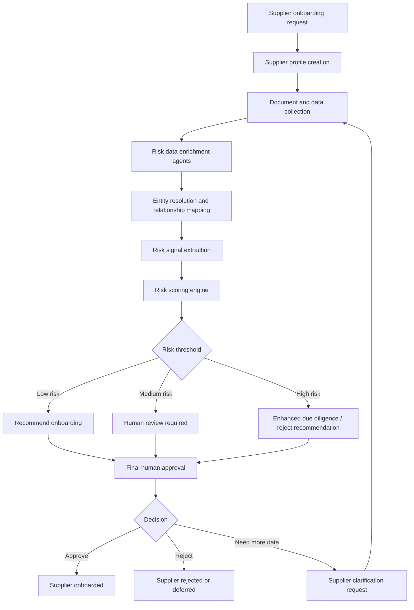
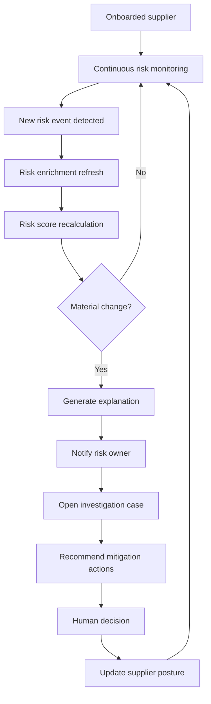

# Application Workflow

## Objective

The application evaluates supplier risk before onboarding and continuously monitors onboarded suppliers after approval. The core capability is the Risk Data Enrichment Module, supported by agentic AI and human-in-the-loop decisioning.

## Pre-Onboarding Workflow

## Post-Onboarding Dynamic Risk Workflow

## Key Decision Points

| Stage | AI Responsibility | Human Responsibility |
|---|---|---|
| Intake | Extract supplier information from forms and documents | Validate missing or unclear details |
| Enrichment | Gather signals from internal and external sources | Confirm source relevance for critical findings |
| Scoring | Calculate category and composite risk scores | Challenge or override with justification |
| Recommendation | Recommend approve, review, reject, or enhanced due diligence | Make final onboarding decision |
| Monitoring | Detect meaningful risk changes | Decide mitigation, suspension, or continuation |

## Risk Decision Thresholds

| Score | Risk Level | Recommended Action |
|---|---|---|
| 0-39 | Low | Recommend onboarding |
| 40-69 | Medium | Human review |
| 70-84 | High | Enhanced due diligence |
| 85-100 | Critical | Reject, block, or executive approval |

