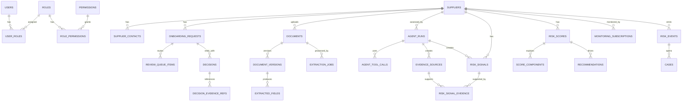

# Project Structure and Database Design

## Objective

This document defines the production-ready backend project structure and SQLite MVP database design for the supplier risk intelligence platform.

It covers:

- Agent module organization.
- External API, OCR, LLM, storage, and web search integrations.
- Repository and persistence boundaries.
- Configuration files.
- Worker layout.
- SQLite database tables, relationships, indexes, and operational rules.

The MVP uses SQLite to reduce setup and network dependency. The schema should remain relational, migration-driven, and portable so the platform can move to PostgreSQL later when concurrency, deployment, or scale requires it.

## Recommended Project Structure

```text
risk-beacon/
├── apps/
│   ├── api/
│   │   ├── app/
│   │   │   ├── main.py
│   │   │   ├── api/
│   │   │   │   ├── routes/
│   │   │   │   │   ├── suppliers.py
│   │   │   │   │   ├── onboarding.py
│   │   │   │   │   ├── documents.py
│   │   │   │   │   ├── agents.py
│   │   │   │   │   ├── scoring.py
│   │   │   │   │   ├── review.py
│   │   │   │   │   ├── decisions.py
│   │   │   │   │   ├── monitoring.py
│   │   │   │   │   └── notifications.py
│   │   │   │   └── dependencies.py
│   │   │   │
│   │   │   ├── agents/
│   │   │   │   ├── base/
│   │   │   │   │   ├── agent.py
│   │   │   │   │   ├── context.py
│   │   │   │   │   ├── errors.py
│   │   │   │   │   ├── lifecycle.py
│   │   │   │   │   ├── registry.py
│   │   │   │   │   └── schemas.py
│   │   │   │   │
│   │   │   │   ├── orchestrator/
│   │   │   │   │   ├── runner.py
│   │   │   │   │   ├── workflow.py
│   │   │   │   │   ├── dependencies.py
│   │   │   │   │   ├── retries.py
│   │   │   │   │   └── idempotency.py
│   │   │   │   │
│   │   │   │   ├── intake/
│   │   │   │   │   ├── agent.py
│   │   │   │   │   ├── schemas.py
│   │   │   │   │   ├── service.py
│   │   │   │   │   └── prompts.py
│   │   │   │   ├── document_intelligence/
│   │   │   │   │   ├── agent.py
│   │   │   │   │   ├── schemas.py
│   │   │   │   │   ├── service.py
│   │   │   │   │   └── prompts.py
│   │   │   │   ├── entity_resolution/
│   │   │   │   │   ├── agent.py
│   │   │   │   │   ├── schemas.py
│   │   │   │   │   ├── matcher.py
│   │   │   │   │   └── service.py
│   │   │   │   ├── sanctions_compliance/
│   │   │   │   │   ├── agent.py
│   │   │   │   │   ├── schemas.py
│   │   │   │   │   └── service.py
│   │   │   │   ├── financial_risk/
│   │   │   │   │   ├── agent.py
│   │   │   │   │   ├── schemas.py
│   │   │   │   │   └── service.py
│   │   │   │   ├── esg_risk/
│   │   │   │   │   ├── agent.py
│   │   │   │   │   ├── schemas.py
│   │   │   │   │   └── service.py
│   │   │   │   ├── news_reputation/
│   │   │   │   │   ├── agent.py
│   │   │   │   │   ├── schemas.py
│   │   │   │   │   └── service.py
│   │   │   │   ├── logistics_risk/
│   │   │   │   │   ├── agent.py
│   │   │   │   │   ├── schemas.py
│   │   │   │   │   └── service.py
│   │   │   │   ├── authenticity/
│   │   │   │   │   ├── agent.py
│   │   │   │   │   ├── schemas.py
│   │   │   │   │   └── service.py
│   │   │   │   ├── anomaly/
│   │   │   │   │   ├── agent.py
│   │   │   │   │   ├── schemas.py
│   │   │   │   │   └── service.py
│   │   │   │   ├── scoring/
│   │   │   │   │   ├── agent.py
│   │   │   │   │   ├── schemas.py
│   │   │   │   │   ├── policy_engine.py
│   │   │   │   │   └── service.py
│   │   │   │   ├── recommendation/
│   │   │   │   │   ├── agent.py
│   │   │   │   │   ├── schemas.py
│   │   │   │   │   └── service.py
│   │   │   │   ├── human_review/
│   │   │   │   │   ├── agent.py
│   │   │   │   │   ├── schemas.py
│   │   │   │   │   └── service.py
│   │   │   │   ├── monitoring/
│   │   │   │   │   ├── agent.py
│   │   │   │   │   ├── schemas.py
│   │   │   │   │   └── service.py
│   │   │   │   └── notification/
│   │   │   │       ├── agent.py
│   │   │   │       ├── schemas.py
│   │   │   │       └── service.py
│   │   │   │
│   │   │   ├── integrations/
│   │   │   │   ├── external_apis/
│   │   │   │   │   ├── base.py
│   │   │   │   │   ├── sanctions_provider.py
│   │   │   │   │   ├── regulatory_notices.py
│   │   │   │   │   ├── legal_filings.py
│   │   │   │   │   ├── company_registry.py
│   │   │   │   │   ├── credit_provider.py
│   │   │   │   │   ├── bankruptcy_records.py
│   │   │   │   │   ├── news_provider.py
│   │   │   │   │   ├── esg_provider.py
│   │   │   │   │   ├── trade_data_provider.py
│   │   │   │   │   ├── route_risk_provider.py
│   │   │   │   │   ├── geopolitical_risk_provider.py
│   │   │   │   │   ├── certificate_registry.py
│   │   │   │   │   ├── email_provider.py
│   │   │   │   │   ├── slack_provider.py
│   │   │   │   │   ├── teams_provider.py
│   │   │   │   │   └── sms_provider.py
│   │   │   │   ├── llm/
│   │   │   │   │   ├── client.py
│   │   │   │   │   ├── structured_outputs.py
│   │   │   │   │   ├── guardrails.py
│   │   │   │   │   └── prompts.py
│   │   │   │   ├── ocr/
│   │   │   │   │   ├── base.py
│   │   │   │   │   ├── tesseract.py
│   │   │   │   │   ├── azure_document_intelligence.py
│   │   │   │   │   └── aws_textract.py
│   │   │   │   ├── storage/
│   │   │   │   │   ├── object_storage.py
│   │   │   │   │   ├── local_storage.py
│   │   │   │   │   └── s3_storage.py
│   │   │   │   └── web_search/
│   │   │   │       ├── client.py
│   │   │   │       └── result_normalizer.py
│   │   │   │
│   │   │   ├── db/
│   │   │   │   ├── session.py
│   │   │   │   ├── sqlite.py
│   │   │   │   ├── migrations/
│   │   │   │   ├── models/
│   │   │   │   │   ├── identity.py
│   │   │   │   │   ├── supplier.py
│   │   │   │   │   ├── onboarding.py
│   │   │   │   │   ├── document.py
│   │   │   │   │   ├── agent_run.py
│   │   │   │   │   ├── evidence.py
│   │   │   │   │   ├── risk_signal.py
│   │   │   │   │   ├── score.py
│   │   │   │   │   ├── recommendation.py
│   │   │   │   │   ├── review.py
│   │   │   │   │   ├── decision.py
│   │   │   │   │   ├── monitoring.py
│   │   │   │   │   ├── case.py
│   │   │   │   │   ├── notification.py
│   │   │   │   │   └── audit.py
│   │   │   │   └── repositories/
│   │   │   │       ├── users.py
│   │   │   │       ├── roles.py
│   │   │   │       ├── suppliers.py
│   │   │   │       ├── onboarding_requests.py
│   │   │   │       ├── documents.py
│   │   │   │       ├── agent_runs.py
│   │   │   │       ├── evidence_sources.py
│   │   │   │       ├── risk_signals.py
│   │   │   │       ├── scores.py
│   │   │   │       ├── recommendations.py
│   │   │   │       ├── review_queue.py
│   │   │   │       ├── decisions.py
│   │   │   │       ├── monitoring.py
│   │   │   │       ├── cases.py
│   │   │   │       ├── notifications.py
│   │   │   │       └── audit_events.py
│   │   │   │
│   │   │   ├── services/
│   │   │   │   ├── persistence_service.py
│   │   │   │   ├── audit_service.py
│   │   │   │   ├── evidence_service.py
│   │   │   │   ├── scoring_policy_service.py
│   │   │   │   ├── review_routing_service.py
│   │   │   │   ├── notification_service.py
│   │   │   │   ├── document_service.py
│   │   │   │   ├── clarification_service.py
│   │   │   │   └── monitoring_service.py
│   │   │   │
│   │   │   ├── workers/
│   │   │   │   ├── celery_app.py
│   │   │   │   ├── agent_tasks.py
│   │   │   │   ├── document_tasks.py
│   │   │   │   ├── enrichment_tasks.py
│   │   │   │   ├── scoring_tasks.py
│   │   │   │   ├── monitoring_tasks.py
│   │   │   │   └── notification_tasks.py
│   │   │   │
│   │   │   ├── config/
│   │   │   │   ├── settings.py
│   │   │   │   ├── agent_config.yaml
│   │   │   │   ├── scoring_policy.yaml
│   │   │   │   ├── notification_policy.yaml
│   │   │   │   ├── document_types.yaml
│   │   │   │   ├── provider_config.yaml
│   │   │   │   ├── rbac_policy.yaml
│   │   │   │   └── monitoring_policy.yaml
│   │   │   │
│   │   │   ├── observability/
│   │   │   │   ├── logging.py
│   │   │   │   ├── metrics.py
│   │   │   │   └── tracing.py
│   │   │   │
│   │   │   └── security/
│   │   │       ├── auth.py
│   │   │       ├── rbac.py
│   │   │       ├── encryption.py
│   │   │       └── redaction.py
│   │   │
│   │   ├── alembic.ini
│   │   ├── pyproject.toml
│   │   └── tests/
│   │       ├── unit/
│   │       ├── integration/
│   │       ├── contract/
│   │       └── fixtures/
│   │
│   └── web/
│       ├── app/
│       ├── components/
│       ├── lib/
│       └── tests/
│
├── data/
│   └── risk_beacon.db
│
├── storage/
│   ├── documents/
│   ├── evidence/
│   └── agent-artifacts/
│
├── documents/
│   ├── agents-workflow.md
│   ├── project-structure-and-database-design.md
│   └── ...
│
├── .env.example
├── docker-compose.yml
└── README.md
```

## Project Structure Responsibilities

| Area | Responsibility |
|---|---|
| `api/routes` | HTTP API boundaries for suppliers, onboarding, documents, agents, scoring, review, decisions, monitoring, and notifications |
| `agents/base` | Shared agent interface, lifecycle contracts, errors, registry, and common schemas |
| `agents/orchestrator` | Runs agent workflows, enforces dependencies, idempotency, retries, and output validation |
| `agents/<agent_name>` | Agent-specific schemas, execution logic, prompts, and service orchestration |
| `integrations/external_apis` | All third-party provider clients; agents should not call raw external APIs directly |
| `integrations/llm` | LLM client, structured output handling, prompt utilities, and AI guardrails |
| `integrations/ocr` | OCR provider adapters and fallback OCR implementations |
| `integrations/storage` | Local or S3-compatible object storage abstraction |
| `integrations/web_search` | Search client and result normalization |
| `db/models` | SQLModel or SQLAlchemy ORM models |
| `db/repositories` | All SQLite reads and writes; agents should not write SQL directly |
| `services/persistence_service.py` | Validates and persists agent outputs in short SQLite transactions |
| `services/audit_service.py` | Writes immutable audit events for material actions |
| `workers` | Background task execution for documents, agents, enrichment, scoring, monitoring, and notifications |
| `config` | Runtime configuration, policies, provider settings, agent tool permissions, and scoring rules |
| `observability` | Structured logs, metrics, and traces |
| `security` | Email/password authentication, password hashing, RBAC, supplier visibility checks, redaction, and encryption helpers |

## Agent Module Contract

Each agent module should follow the same internal shape.

```text
agents/<agent_name>/
├── agent.py
├── schemas.py
├── service.py
└── prompts.py
```

| File | Responsibility |
|---|---|
| `agent.py` | Implements the shared agent interface and coordinates the run |
| `schemas.py` | Defines versioned JSON input and output schemas |
| `service.py` | Calls repositories, external integrations, LLM, OCR, and internal utilities |
| `prompts.py` | Stores prompt templates if the agent uses an LLM |

Example flow:

```text
API route or worker task
→ Agent Orchestrator
→ Agent Runner
→ Agent-specific service
→ Tool registry
→ DB repositories / external APIs / OCR / LLM / storage
→ Validated agent output
→ Persistence service
→ SQLite + object storage + audit events
```

## Configuration Files

### `agent_config.yaml`

Defines enabled agents, allowed tools, retry policy, and execution mode.

```yaml
agents:
  sanctions_compliance:
    enabled: true
    execution_mode: background
    timeout_seconds: 60
    retries: 2
    tools:
      - db.suppliers.get
      - db.entity_matches.list
      - external.sanctions_provider.screen
      - external.regulatory_notices.search
      - db.risk_signals.insert
      - db.evidence_sources.insert
      - audit.log_event

  scoring:
    enabled: true
    execution_mode: sync_or_background
    timeout_seconds: 15
    retries: 1
    tools:
      - db.risk_signals.list
      - db.scoring_policy.get_active
      - policy_engine.calculate_score
      - db.risk_scores.insert
      - db.score_components.insert
      - audit.log_event
```

### `provider_config.yaml`

Defines external provider settings without storing secrets directly.

```yaml
providers:
  sanctions_provider:
    enabled: true
    base_url_env: SANCTIONS_PROVIDER_BASE_URL
    api_key_env: SANCTIONS_PROVIDER_API_KEY
    timeout_seconds: 10
    retries: 2

  news_provider:
    enabled: true
    base_url_env: NEWS_PROVIDER_BASE_URL
    api_key_env: NEWS_PROVIDER_API_KEY
    timeout_seconds: 15
    retries: 2
```

### `scoring_policy.yaml`

Keeps scoring deterministic and versioned.

```yaml
policy_id: POLICY-001
version: "2026.05.01"

thresholds:
  low: [0, 39]
  medium: [40, 69]
  high: [70, 84]
  critical: [85, 100]

category_weights:
  compliance: 0.25
  financial: 0.15
  esg: 0.15
  cyber: 0.10
  operational: 0.10
  reputation: 0.10
  logistics: 0.05
  authenticity: 0.10
```

### `document_types.yaml`

Defines required and optional documents by workflow.

```yaml
document_types:
  business_registration:
    required_for: ["pre_onboarding"]
    allowed_mime_types: ["application/pdf", "image/png", "image/jpeg"]
    extraction_fields:
      - legal_name
      - registration_number
      - registered_address
      - issue_date

  financial_statement:
    required_for: ["financial_review"]
    allowed_mime_types: ["application/pdf", "application/vnd.openxmlformats-officedocument.spreadsheetml.sheet"]
    extraction_fields:
      - revenue
      - net_income
      - total_debt
      - cash_balance
```

## SQLite MVP Database Setup

Use SQLite as the MVP transactional database.

```text
Database file: ./data/risk_beacon.db
ORM: SQLModel or SQLAlchemy
Migrations: Alembic
ID type: TEXT UUID or ULID
Timestamp format: UTC ISO-8601
JSON fields: TEXT containing validated JSON
```

Enable these pragmas when the application opens a database connection:

```sql
PRAGMA journal_mode=WAL;
PRAGMA busy_timeout=5000;
PRAGMA foreign_keys=ON;
```

SQLite write rules:

- Keep transactions short.
- Use repository methods for all database access.
- Persist agent outputs through `persistence_service.py`.
- Retry transient `database is locked` errors.
- Allow agents to perform API, OCR, LLM, and search work in parallel, but keep SQLite writes controlled.
- Do not use the same SQLite file as a shared database across multiple app servers.

## Database Table Groups

| Group | Tables |
|---|---|
| Identity and Access | `users`, `roles`, `permissions`, `user_roles`, `role_permissions`, `supplier_user_access`, `buyer_supplier_access` |
| Supplier Domain | `suppliers`, `supplier_contacts`, `supplier_relationships` |
| Onboarding | `onboarding_requests`, `clarification_requests`, `clarification_responses` |
| Documents | `documents`, `document_versions`, `extraction_jobs`, `extracted_fields` |
| Agents | `agent_runs`, `agent_tool_calls`, `agent_artifacts`, `agent_warnings`, `agent_errors` |
| Evidence and Risk | `evidence_sources`, `risk_signals`, `risk_signal_evidence`, `entity_matches`, `authenticity_findings`, `anomaly_findings` |
| Scoring | `scoring_policies`, `risk_scores`, `score_components`, `score_overrides`, `recommendations` |
| Review and Decisions | `review_queue_items`, `review_packets`, `decisions`, `decision_evidence_refs` |
| Monitoring and Cases | `monitoring_subscriptions`, `risk_events`, `score_movements`, `cases`, `case_comments`, `case_tasks` |
| Notifications | `notifications`, `notification_deliveries` |
| Audit | `audit_events` |

## Standard Columns

Most tables should include:

```text
id TEXT PRIMARY KEY
tenant_id TEXT NOT NULL
created_at TEXT NOT NULL
updated_at TEXT
created_by TEXT
status TEXT
```

Agent, evidence, risk, score, decision, and audit tables should also include:

```text
correlation_id TEXT
agent_run_id TEXT
source_ref TEXT
confidence REAL
severity TEXT
snapshot_storage_key TEXT
```

## Identity and Access Tables

MVP authentication should use simple email and password login. Store password hashes only. Do not store raw passwords.

Supplier visibility must be enforced in backend repositories and API dependencies, not only in frontend UI filters.

### `users`

Stores platform users.

| Column | Type | Notes |
|---|---|---|
| `id` | TEXT | Primary key |
| `tenant_id` | TEXT | Required |
| `email` | TEXT | Unique per tenant |
| `password_hash` | TEXT | Required for MVP email/password login |
| `name` | TEXT | Display name |
| `status` | TEXT | `active`, `invited`, `disabled` |
| `last_login_at` | TEXT | Nullable UTC timestamp |
| `created_at` | TEXT | UTC timestamp |
| `updated_at` | TEXT | UTC timestamp |

Indexes:

```text
UNIQUE(tenant_id, email)
INDEX(tenant_id, status)
```

### `roles`

Stores role definitions.

| Column | Type | Notes |
|---|---|---|
| `id` | TEXT | Primary key |
| `tenant_id` | TEXT | Required |
| `name` | TEXT | Role name |
| `description` | TEXT | Role description |
| `created_at` | TEXT | UTC timestamp |

Indexes:

```text
UNIQUE(tenant_id, name)
```

Initial MVP role seed data:

```json
[
  "Supplier Admin",
  "Procurement Buyer",
  "Risk Analyst",
  "Supplier Relationship Manager",
  "Approver / Risk Committee",
  "System Administrator",
  "Auditor"
]
```

The application should not seed separate category-specific reviewer roles. Compliance, financial, ESG, and cyber findings remain risk categories and should route to the Risk Analyst role.

### `permissions`

Stores granular permissions.

| Column | Type | Notes |
|---|---|---|
| `id` | TEXT | Primary key |
| `area` | TEXT | Example: `documents`, `risk_score`, `decisions` |
| `action` | TEXT | Example: `view`, `create`, `override`, `approve` |
| `description` | TEXT | Permission description |

Indexes:

```text
UNIQUE(area, action)
```

### `user_roles`

Maps users to roles. For MVP, tenant-scoped roles are enough for internal roles, while supplier-specific access should be enforced through `supplier_user_access` and buyer-specific visibility through `buyer_supplier_access`.

| Column | Type | Notes |
|---|---|---|
| `user_id` | TEXT | FK to `users.id` |
| `role_id` | TEXT | FK to `roles.id` |
| `assigned_at` | TEXT | UTC timestamp |
| `assigned_by` | TEXT | FK to `users.id` |

Constraints:

```text
PRIMARY KEY(user_id, role_id)
```

### `role_permissions`

Maps roles to permissions.

| Column | Type | Notes |
|---|---|---|
| `role_id` | TEXT | FK to `roles.id` |
| `permission_id` | TEXT | FK to `permissions.id` |

Constraints:

```text
PRIMARY KEY(role_id, permission_id)
```

### `supplier_user_access`

Maps external supplier users to supplier records they can access.

| Column | Type | Notes |
|---|---|---|
| `id` | TEXT | Primary key |
| `tenant_id` | TEXT | Required |
| `supplier_id` | TEXT | FK to `suppliers.id` |
| `user_id` | TEXT | FK to `users.id` |
| `supplier_contact_id` | TEXT | Nullable FK to `supplier_contacts.id` |
| `access_role` | TEXT | Example: `supplier_admin`, `supplier_viewer` |
| `status` | TEXT | `invited`, `active`, `revoked` |
| `invited_by` | TEXT | FK to `users.id` |
| `invited_at` | TEXT | Nullable UTC timestamp |
| `accepted_at` | TEXT | Nullable UTC timestamp |
| `revoked_at` | TEXT | Nullable UTC timestamp |
| `created_at` | TEXT | UTC timestamp |

Indexes:

```text
UNIQUE(tenant_id, supplier_id, user_id)
INDEX(tenant_id, user_id, status)
INDEX(tenant_id, supplier_id, status)
```

### `buyer_supplier_access`

Maps buyers to supplier records they can view or manage. Buyers must only see suppliers linked to them through this table, onboarding ownership, or an equivalent assignment rule.

| Column | Type | Notes |
|---|---|---|
| `id` | TEXT | Primary key |
| `tenant_id` | TEXT | Required |
| `supplier_id` | TEXT | FK to `suppliers.id` |
| `user_id` | TEXT | FK to `users.id` |
| `access_level` | TEXT | `view`, `manage_onboarding` |
| `status` | TEXT | `active`, `revoked` |
| `assigned_by` | TEXT | FK to `users.id` |
| `assigned_at` | TEXT | UTC timestamp |
| `revoked_at` | TEXT | Nullable UTC timestamp |

Indexes:

```text
UNIQUE(tenant_id, supplier_id, user_id)
INDEX(tenant_id, user_id, status)
INDEX(tenant_id, supplier_id, status)
```

## Supplier Domain Tables

### `suppliers`

Stores supplier master profile.

| Column | Type | Notes |
|---|---|---|
| `id` | TEXT | Primary key |
| `tenant_id` | TEXT | Required |
| `legal_name` | TEXT | Required |
| `trade_names_json` | TEXT | JSON array |
| `country` | TEXT | ISO country code |
| `tax_id` | TEXT | Nullable |
| `registration_number` | TEXT | Nullable |
| `website` | TEXT | Nullable |
| `industry` | TEXT | Nullable |
| `commodity_category` | TEXT | Nullable |
| `supplier_tier` | TEXT | Nullable |
| `status` | TEXT | `draft`, `pending_review`, `approved`, `rejected`, `archived` |
| `metadata_json` | TEXT | Validated JSON |
| `created_at` | TEXT | UTC timestamp |
| `updated_at` | TEXT | UTC timestamp |

Indexes:

```text
INDEX(tenant_id, status)
INDEX(tenant_id, legal_name)
INDEX(tenant_id, country)
UNIQUE(tenant_id, tax_id)
UNIQUE(tenant_id, registration_number)
```

### `supplier_contacts`

Stores supplier contact details.

| Column | Type | Notes |
|---|---|---|
| `id` | TEXT | Primary key |
| `tenant_id` | TEXT | Required |
| `supplier_id` | TEXT | FK to `suppliers.id` |
| `name` | TEXT | Required |
| `email` | TEXT | Nullable |
| `phone` | TEXT | Nullable |
| `role` | TEXT | Example: `Supplier Admin` |
| `is_primary` | INTEGER | Boolean |
| `created_at` | TEXT | UTC timestamp |

Indexes:

```text
INDEX(tenant_id, supplier_id)
INDEX(tenant_id, email)
```

### `supplier_relationships`

Stores parent, subsidiary, branch, director, and UBO relationships.

| Column | Type | Notes |
|---|---|---|
| `id` | TEXT | Primary key |
| `tenant_id` | TEXT | Required |
| `supplier_id` | TEXT | FK to `suppliers.id` |
| `relationship_type` | TEXT | `parent`, `subsidiary`, `branch`, `director`, `ubo` |
| `related_entity_name` | TEXT | Required |
| `related_entity_identifier` | TEXT | Nullable |
| `related_supplier_id` | TEXT | Nullable FK to `suppliers.id` |
| `confidence` | REAL | 0 to 1 |
| `evidence_source_id` | TEXT | FK to `evidence_sources.id` |
| `created_at` | TEXT | UTC timestamp |

Indexes:

```text
INDEX(tenant_id, supplier_id, relationship_type)
INDEX(tenant_id, related_entity_name)
```

## Onboarding Tables

### `onboarding_requests`

Tracks pre-onboarding workflow instances.

| Column | Type | Notes |
|---|---|---|
| `id` | TEXT | Primary key |
| `tenant_id` | TEXT | Required |
| `supplier_id` | TEXT | FK to `suppliers.id` |
| `requester_id` | TEXT | FK to `users.id` |
| `status` | TEXT | `draft`, `submitted`, `in_assessment`, `in_review`, `approved`, `rejected`, `deferred`, `needs_information` |
| `submitted_at` | TEXT | Nullable |
| `decided_at` | TEXT | Nullable |
| `created_at` | TEXT | UTC timestamp |
| `updated_at` | TEXT | UTC timestamp |

Indexes:

```text
INDEX(tenant_id, status)
INDEX(tenant_id, supplier_id)
INDEX(tenant_id, requester_id)
```

### `clarification_requests`

Stores requests for additional supplier information.

| Column | Type | Notes |
|---|---|---|
| `id` | TEXT | Primary key |
| `tenant_id` | TEXT | Required |
| `onboarding_request_id` | TEXT | FK to `onboarding_requests.id` |
| `supplier_id` | TEXT | FK to `suppliers.id` |
| `requested_by` | TEXT | FK to `users.id` |
| `assigned_to_contact_id` | TEXT | FK to `supplier_contacts.id` |
| `status` | TEXT | `open`, `responded`, `closed`, `cancelled` |
| `reason` | TEXT | Required |
| `requested_fields_json` | TEXT | JSON array |
| `due_at` | TEXT | Nullable |
| `created_at` | TEXT | UTC timestamp |

Indexes:

```text
INDEX(tenant_id, onboarding_request_id, status)
INDEX(tenant_id, supplier_id)
```

### `clarification_responses`

Stores supplier responses to clarification requests.

| Column | Type | Notes |
|---|---|---|
| `id` | TEXT | Primary key |
| `tenant_id` | TEXT | Required |
| `clarification_request_id` | TEXT | FK to `clarification_requests.id` |
| `responded_by_contact_id` | TEXT | FK to `supplier_contacts.id` |
| `response_text` | TEXT | Nullable |
| `response_payload_json` | TEXT | Validated JSON |
| `created_at` | TEXT | UTC timestamp |

Indexes:

```text
INDEX(tenant_id, clarification_request_id)
```

## Document Tables

### `documents`

Stores uploaded document metadata.

| Column | Type | Notes |
|---|---|---|
| `id` | TEXT | Primary key |
| `tenant_id` | TEXT | Required |
| `supplier_id` | TEXT | FK to `suppliers.id` |
| `onboarding_request_id` | TEXT | Nullable FK |
| `document_type` | TEXT | Example: `business_registration` |
| `current_version_id` | TEXT | FK to `document_versions.id` |
| `status` | TEXT | `uploaded`, `extracting`, `extracted`, `failed`, `replaced`, `archived` |
| `authenticity_status` | TEXT | `not_checked`, `passed`, `warning`, `failed`, `needs_review` |
| `uploaded_by` | TEXT | FK to `users.id` |
| `uploaded_at` | TEXT | UTC timestamp |

Indexes:

```text
INDEX(tenant_id, supplier_id, document_type)
INDEX(tenant_id, onboarding_request_id)
INDEX(tenant_id, status)
```

### `document_versions`

Stores immutable document version metadata.

| Column | Type | Notes |
|---|---|---|
| `id` | TEXT | Primary key |
| `tenant_id` | TEXT | Required |
| `document_id` | TEXT | FK to `documents.id` |
| `version_number` | INTEGER | Starts at 1 |
| `file_name` | TEXT | Original file name |
| `mime_type` | TEXT | Required |
| `storage_key` | TEXT | Object storage key |
| `checksum_sha256` | TEXT | Required |
| `size_bytes` | INTEGER | File size |
| `uploaded_by` | TEXT | FK to `users.id` |
| `uploaded_at` | TEXT | UTC timestamp |

Indexes:

```text
UNIQUE(tenant_id, document_id, version_number)
INDEX(tenant_id, checksum_sha256)
```

### `extraction_jobs`

Tracks OCR and document extraction lifecycle.

| Column | Type | Notes |
|---|---|---|
| `id` | TEXT | Primary key |
| `tenant_id` | TEXT | Required |
| `document_id` | TEXT | FK to `documents.id` |
| `document_version_id` | TEXT | FK to `document_versions.id` |
| `agent_run_id` | TEXT | FK to `agent_runs.id` |
| `provider` | TEXT | Example: `tesseract`, `azure_document_intelligence` |
| `status` | TEXT | `queued`, `running`, `succeeded`, `failed`, `cancelled` |
| `started_at` | TEXT | Nullable |
| `completed_at` | TEXT | Nullable |
| `error_json` | TEXT | Nullable |

Indexes:

```text
INDEX(tenant_id, document_id, status)
INDEX(tenant_id, agent_run_id)
```

### `extracted_fields`

Stores normalized fields extracted from documents.

| Column | Type | Notes |
|---|---|---|
| `id` | TEXT | Primary key |
| `tenant_id` | TEXT | Required |
| `document_id` | TEXT | FK to `documents.id` |
| `document_version_id` | TEXT | FK to `document_versions.id` |
| `field_name` | TEXT | Required |
| `value` | TEXT | Extracted value |
| `normalized_value` | TEXT | Optional normalized value |
| `confidence` | REAL | 0 to 1 |
| `source_location_json` | TEXT | Page and bounding box JSON |
| `created_at` | TEXT | UTC timestamp |

Indexes:

```text
INDEX(tenant_id, document_id, field_name)
INDEX(tenant_id, field_name, normalized_value)
```

## Agent Tables

### `agent_runs`

Stores one record per agent execution.

| Column | Type | Notes |
|---|---|---|
| `id` | TEXT | Primary key |
| `tenant_id` | TEXT | Required |
| `agent_name` | TEXT | Required |
| `agent_version` | TEXT | Required |
| `supplier_id` | TEXT | Nullable FK |
| `onboarding_request_id` | TEXT | Nullable FK |
| `correlation_id` | TEXT | Required |
| `idempotency_key` | TEXT | Required |
| `status` | TEXT | `queued`, `running`, `succeeded`, `partially_succeeded`, `failed`, `skipped`, `requires_human_review` |
| `input_ref` | TEXT | Object storage key for input JSON |
| `output_ref` | TEXT | Object storage key for output JSON |
| `started_at` | TEXT | Nullable |
| `completed_at` | TEXT | Nullable |
| `error_json` | TEXT | Nullable |

Indexes:

```text
UNIQUE(tenant_id, idempotency_key)
INDEX(tenant_id, supplier_id, agent_name)
INDEX(tenant_id, status)
INDEX(tenant_id, correlation_id)
```

### `agent_tool_calls`

Stores tool calls made during agent execution.

| Column | Type | Notes |
|---|---|---|
| `id` | TEXT | Primary key |
| `tenant_id` | TEXT | Required |
| `agent_run_id` | TEXT | FK to `agent_runs.id` |
| `tool_name` | TEXT | Required |
| `tool_type` | TEXT | `db`, `external_api`, `ocr`, `llm`, `storage`, `web_search`, `internal` |
| `status` | TEXT | `succeeded`, `failed`, `retried`, `skipped` |
| `request_ref` | TEXT | Redacted request payload storage key |
| `response_ref` | TEXT | Response snapshot storage key |
| `started_at` | TEXT | UTC timestamp |
| `completed_at` | TEXT | Nullable |
| `error_json` | TEXT | Nullable |

Indexes:

```text
INDEX(tenant_id, agent_run_id)
INDEX(tenant_id, tool_name, status)
```

### `agent_artifacts`

Stores references to agent input, output, intermediate files, and snapshots.

| Column | Type | Notes |
|---|---|---|
| `id` | TEXT | Primary key |
| `tenant_id` | TEXT | Required |
| `agent_run_id` | TEXT | FK to `agent_runs.id` |
| `artifact_type` | TEXT | `input`, `output`, `provider_response`, `ocr_text`, `snapshot` |
| `storage_key` | TEXT | Object storage key |
| `checksum_sha256` | TEXT | Nullable |
| `created_at` | TEXT | UTC timestamp |

Indexes:

```text
INDEX(tenant_id, agent_run_id, artifact_type)
```

### `agent_warnings`

Stores non-blocking agent warnings.

| Column | Type | Notes |
|---|---|---|
| `id` | TEXT | Primary key |
| `tenant_id` | TEXT | Required |
| `agent_run_id` | TEXT | FK to `agent_runs.id` |
| `warning_code` | TEXT | Required |
| `message` | TEXT | Safe warning message |
| `severity` | TEXT | `low`, `medium`, `high` |
| `created_at` | TEXT | UTC timestamp |

Indexes:

```text
INDEX(tenant_id, agent_run_id)
```

### `agent_errors`

Stores structured agent failures.

| Column | Type | Notes |
|---|---|---|
| `id` | TEXT | Primary key |
| `tenant_id` | TEXT | Required |
| `agent_run_id` | TEXT | FK to `agent_runs.id` |
| `error_code` | TEXT | Required |
| `message` | TEXT | Safe error message |
| `retryable` | INTEGER | Boolean |
| `severity` | TEXT | `low`, `medium`, `high`, `critical` |
| `error_json` | TEXT | Redacted JSON details |
| `created_at` | TEXT | UTC timestamp |

Indexes:

```text
INDEX(tenant_id, agent_run_id)
INDEX(tenant_id, error_code)
```

## Evidence and Risk Tables

### `evidence_sources`

Stores source metadata for material findings.

| Column | Type | Notes |
|---|---|---|
| `id` | TEXT | Primary key |
| `tenant_id` | TEXT | Required |
| `supplier_id` | TEXT | FK to `suppliers.id` |
| `agent_run_id` | TEXT | FK to `agent_runs.id` |
| `source_type` | TEXT | `document`, `external_api`, `web`, `news`, `registry`, `internal` |
| `name` | TEXT | Source name |
| `url` | TEXT | Nullable |
| `provider_record_id` | TEXT | Nullable |
| `retrieved_at` | TEXT | UTC timestamp |
| `credibility_score` | REAL | 0 to 1 |
| `snapshot_storage_key` | TEXT | Object storage key |
| `metadata_json` | TEXT | Validated JSON |

Indexes:

```text
INDEX(tenant_id, supplier_id, source_type)
INDEX(tenant_id, agent_run_id)
INDEX(tenant_id, retrieved_at)
```

### `risk_signals`

Stores normalized findings used by scoring.

| Column | Type | Notes |
|---|---|---|
| `id` | TEXT | Primary key |
| `tenant_id` | TEXT | Required |
| `supplier_id` | TEXT | FK to `suppliers.id` |
| `agent_run_id` | TEXT | FK to `agent_runs.id` |
| `category` | TEXT | `compliance`, `financial`, `esg`, `cyber`, `operational`, `reputation`, `logistics`, `authenticity`, `entity`, `anomaly` |
| `signal` | TEXT | Human-readable finding |
| `severity` | TEXT | `low`, `medium`, `high`, `critical` |
| `confidence` | REAL | 0 to 1 |
| `extracted_facts_json` | TEXT | Facts only |
| `interpretation` | TEXT | Model or rule interpretation |
| `recommended_action` | TEXT | Advisory action |
| `status` | TEXT | `active`, `dismissed`, `accepted`, `superseded` |
| `created_at` | TEXT | UTC timestamp |

Indexes:

```text
INDEX(tenant_id, supplier_id, category)
INDEX(tenant_id, supplier_id, severity)
INDEX(tenant_id, status)
INDEX(tenant_id, agent_run_id)
```

### `risk_signal_evidence`

Many-to-many link between risk signals and evidence sources.

| Column | Type | Notes |
|---|---|---|
| `risk_signal_id` | TEXT | FK to `risk_signals.id` |
| `evidence_source_id` | TEXT | FK to `evidence_sources.id` |

Constraints:

```text
PRIMARY KEY(risk_signal_id, evidence_source_id)
```

### `entity_matches`

Stores legal entity, alias, director, UBO, parent, and subsidiary matches.

| Column | Type | Notes |
|---|---|---|
| `id` | TEXT | Primary key |
| `tenant_id` | TEXT | Required |
| `supplier_id` | TEXT | FK to `suppliers.id` |
| `agent_run_id` | TEXT | FK to `agent_runs.id` |
| `match_type` | TEXT | `legal_entity`, `alias`, `director`, `ubo`, `parent`, `subsidiary`, `address` |
| `matched_name` | TEXT | Required |
| `matched_identifier` | TEXT | Nullable |
| `confidence` | REAL | 0 to 1 |
| `match_factors_json` | TEXT | Validated JSON array |
| `evidence_source_id` | TEXT | FK to `evidence_sources.id` |
| `status` | TEXT | `candidate`, `confirmed`, `dismissed` |
| `created_at` | TEXT | UTC timestamp |

Indexes:

```text
INDEX(tenant_id, supplier_id, match_type)
INDEX(tenant_id, matched_name)
INDEX(tenant_id, status)
```

### `authenticity_findings`

Stores document authenticity findings.

| Column | Type | Notes |
|---|---|---|
| `id` | TEXT | Primary key |
| `tenant_id` | TEXT | Required |
| `document_id` | TEXT | FK to `documents.id` |
| `document_version_id` | TEXT | FK to `document_versions.id` |
| `agent_run_id` | TEXT | FK to `agent_runs.id` |
| `finding_type` | TEXT | `metadata_inconsistency`, `visual_tampering`, `certificate_mismatch`, `template_reuse` |
| `finding` | TEXT | Required |
| `severity` | TEXT | Required |
| `confidence` | REAL | 0 to 1 |
| `evidence_source_id` | TEXT | FK to `evidence_sources.id` |
| `status` | TEXT | `active`, `dismissed`, `accepted` |
| `created_at` | TEXT | UTC timestamp |

Indexes:

```text
INDEX(tenant_id, document_id)
INDEX(tenant_id, severity, status)
```

### `anomaly_findings`

Stores behavior and pattern anomalies.

| Column | Type | Notes |
|---|---|---|
| `id` | TEXT | Primary key |
| `tenant_id` | TEXT | Required |
| `supplier_id` | TEXT | FK to `suppliers.id` |
| `agent_run_id` | TEXT | FK to `agent_runs.id` |
| `anomaly_type` | TEXT | Required |
| `description` | TEXT | Required |
| `baseline_json` | TEXT | Peer or historical baseline |
| `observed_json` | TEXT | Observed values |
| `severity` | TEXT | Required |
| `confidence` | REAL | 0 to 1 |
| `evidence_source_id` | TEXT | FK to `evidence_sources.id` |
| `status` | TEXT | `active`, `dismissed`, `accepted` |
| `created_at` | TEXT | UTC timestamp |

Indexes:

```text
INDEX(tenant_id, supplier_id, anomaly_type)
INDEX(tenant_id, severity, status)
```

## Scoring Tables

### `scoring_policies`

Stores versioned scoring policy snapshots.

| Column | Type | Notes |
|---|---|---|
| `id` | TEXT | Primary key |
| `tenant_id` | TEXT | Required |
| `policy_key` | TEXT | Example: `default_supplier_risk` |
| `version` | TEXT | Required |
| `status` | TEXT | `draft`, `active`, `retired` |
| `policy_json` | TEXT | Full scoring policy JSON |
| `created_by` | TEXT | FK to `users.id` |
| `created_at` | TEXT | UTC timestamp |

Indexes:

```text
UNIQUE(tenant_id, policy_key, version)
INDEX(tenant_id, policy_key, status)
```

### `risk_scores`

Stores composite supplier risk score snapshots.

| Column | Type | Notes |
|---|---|---|
| `id` | TEXT | Primary key |
| `tenant_id` | TEXT | Required |
| `supplier_id` | TEXT | FK to `suppliers.id` |
| `onboarding_request_id` | TEXT | Nullable FK |
| `agent_run_id` | TEXT | FK to `agent_runs.id` |
| `scoring_policy_id` | TEXT | FK to `scoring_policies.id` |
| `composite_score` | INTEGER | 0 to 100 |
| `risk_level` | TEXT | `low`, `medium`, `high`, `critical` |
| `calculated_at` | TEXT | UTC timestamp |

Indexes:

```text
INDEX(tenant_id, supplier_id, calculated_at)
INDEX(tenant_id, onboarding_request_id)
INDEX(tenant_id, risk_level)
```

### `score_components`

Stores explainable category and signal score contributions.

| Column | Type | Notes |
|---|---|---|
| `id` | TEXT | Primary key |
| `tenant_id` | TEXT | Required |
| `risk_score_id` | TEXT | FK to `risk_scores.id` |
| `category` | TEXT | Required |
| `score` | INTEGER | 0 to 100 |
| `weight` | REAL | Category weight |
| `risk_signal_id` | TEXT | Nullable FK to `risk_signals.id` |
| `explanation` | TEXT | Required |

Indexes:

```text
INDEX(tenant_id, risk_score_id)
INDEX(tenant_id, category)
```

### `score_overrides`

Stores human score overrides.

| Column | Type | Notes |
|---|---|---|
| `id` | TEXT | Primary key |
| `tenant_id` | TEXT | Required |
| `risk_score_id` | TEXT | FK to `risk_scores.id` |
| `supplier_id` | TEXT | FK to `suppliers.id` |
| `overridden_score` | INTEGER | 0 to 100 |
| `overridden_risk_level` | TEXT | Required |
| `reason` | TEXT | Required |
| `overridden_by` | TEXT | FK to `users.id` |
| `created_at` | TEXT | UTC timestamp |

Indexes:

```text
INDEX(tenant_id, supplier_id)
INDEX(tenant_id, risk_score_id)
```

### `recommendations`

Stores AI-assisted recommendations.

| Column | Type | Notes |
|---|---|---|
| `id` | TEXT | Primary key |
| `tenant_id` | TEXT | Required |
| `supplier_id` | TEXT | FK to `suppliers.id` |
| `onboarding_request_id` | TEXT | Nullable FK |
| `agent_run_id` | TEXT | FK to `agent_runs.id` |
| `risk_score_id` | TEXT | FK to `risk_scores.id` |
| `recommended_action` | TEXT | Advisory action only |
| `recommended_owner_role` | TEXT | Nullable |
| `summary` | TEXT | Required |
| `rationale_json` | TEXT | Evidence-linked rationale |
| `status` | TEXT | `active`, `superseded`, `dismissed` |
| `created_at` | TEXT | UTC timestamp |

Indexes:

```text
INDEX(tenant_id, supplier_id, status)
INDEX(tenant_id, onboarding_request_id)
```

## Review and Decision Tables

### `review_queue_items`

Stores human review work items.

| Column | Type | Notes |
|---|---|---|
| `id` | TEXT | Primary key |
| `tenant_id` | TEXT | Required |
| `supplier_id` | TEXT | FK to `suppliers.id` |
| `onboarding_request_id` | TEXT | FK to `onboarding_requests.id` |
| `review_packet_id` | TEXT | Nullable FK to `review_packets.id` |
| `assigned_role` | TEXT | Required |
| `assigned_user_id` | TEXT | Nullable FK to `users.id` |
| `priority` | TEXT | `low`, `medium`, `high`, `critical` |
| `status` | TEXT | `open`, `in_progress`, `completed`, `cancelled` |
| `created_at` | TEXT | UTC timestamp |
| `due_at` | TEXT | Nullable |

Indexes:

```text
INDEX(tenant_id, status, assigned_role)
INDEX(tenant_id, assigned_user_id, status)
INDEX(tenant_id, supplier_id)
```

### `review_packets`

Stores generated human review summaries.

| Column | Type | Notes |
|---|---|---|
| `id` | TEXT | Primary key |
| `tenant_id` | TEXT | Required |
| `supplier_id` | TEXT | FK to `suppliers.id` |
| `onboarding_request_id` | TEXT | FK to `onboarding_requests.id` |
| `agent_run_id` | TEXT | FK to `agent_runs.id` |
| `summary` | TEXT | Required |
| `sections_json` | TEXT | Evidence-linked review sections |
| `available_decisions_json` | TEXT | Allowed decisions |
| `created_at` | TEXT | UTC timestamp |

Indexes:

```text
INDEX(tenant_id, supplier_id)
INDEX(tenant_id, onboarding_request_id)
```

### `decisions`

Stores final human decisions.

| Column | Type | Notes |
|---|---|---|
| `id` | TEXT | Primary key |
| `tenant_id` | TEXT | Required |
| `supplier_id` | TEXT | FK to `suppliers.id` |
| `onboarding_request_id` | TEXT | FK to `onboarding_requests.id` |
| `decision` | TEXT | `approve`, `reject`, `defer`, `request_information`, `enhanced_due_diligence` |
| `reason` | TEXT | Required |
| `decided_by` | TEXT | FK to `users.id` |
| `decided_at` | TEXT | UTC timestamp |
| `metadata_json` | TEXT | Validated JSON |

Indexes:

```text
INDEX(tenant_id, supplier_id, decided_at)
INDEX(tenant_id, onboarding_request_id)
INDEX(tenant_id, decision)
```

### `decision_evidence_refs`

Links decisions to evidence and risk signals.

| Column | Type | Notes |
|---|---|---|
| `decision_id` | TEXT | FK to `decisions.id` |
| `evidence_source_id` | TEXT | Nullable FK to `evidence_sources.id` |
| `risk_signal_id` | TEXT | Nullable FK to `risk_signals.id` |

Indexes:

```text
INDEX(decision_id)
INDEX(evidence_source_id)
INDEX(risk_signal_id)
```

## Monitoring and Case Tables

### `monitoring_subscriptions`

Defines post-onboarding monitoring configuration.

| Column | Type | Notes |
|---|---|---|
| `id` | TEXT | Primary key |
| `tenant_id` | TEXT | Required |
| `supplier_id` | TEXT | FK to `suppliers.id` |
| `watched_categories_json` | TEXT | JSON array |
| `cadence` | TEXT | `daily`, `weekly`, `monthly` |
| `thresholds_json` | TEXT | Score delta and critical signal thresholds |
| `status` | TEXT | `active`, `paused`, `disabled` |
| `last_run_at` | TEXT | Nullable |
| `created_at` | TEXT | UTC timestamp |

Indexes:

```text
INDEX(tenant_id, status, cadence)
INDEX(tenant_id, supplier_id)
```

### `risk_events`

Stores monitoring events and external deltas.

| Column | Type | Notes |
|---|---|---|
| `id` | TEXT | Primary key |
| `tenant_id` | TEXT | Required |
| `supplier_id` | TEXT | FK to `suppliers.id` |
| `category` | TEXT | Risk category |
| `event_type` | TEXT | Required |
| `severity` | TEXT | Required |
| `evidence_source_id` | TEXT | Nullable FK |
| `detected_at` | TEXT | UTC timestamp |
| `status` | TEXT | `new`, `processed`, `dismissed` |
| `metadata_json` | TEXT | Validated JSON |

Indexes:

```text
INDEX(tenant_id, supplier_id, detected_at)
INDEX(tenant_id, category, severity)
INDEX(tenant_id, status)
```

### `score_movements`

Stores before/after score movement explanations.

| Column | Type | Notes |
|---|---|---|
| `id` | TEXT | Primary key |
| `tenant_id` | TEXT | Required |
| `supplier_id` | TEXT | FK to `suppliers.id` |
| `previous_score_id` | TEXT | FK to `risk_scores.id` |
| `new_score_id` | TEXT | FK to `risk_scores.id` |
| `score_delta` | INTEGER | Difference |
| `risk_level_changed` | INTEGER | Boolean |
| `explanation` | TEXT | Required |
| `created_at` | TEXT | UTC timestamp |

Indexes:

```text
INDEX(tenant_id, supplier_id, created_at)
```

### `cases`

Stores investigation and remediation cases.

| Column | Type | Notes |
|---|---|---|
| `id` | TEXT | Primary key |
| `tenant_id` | TEXT | Required |
| `supplier_id` | TEXT | FK to `suppliers.id` |
| `risk_event_id` | TEXT | Nullable FK to `risk_events.id` |
| `title` | TEXT | Required |
| `description` | TEXT | Nullable |
| `priority` | TEXT | `low`, `medium`, `high`, `critical` |
| `status` | TEXT | `open`, `in_progress`, `resolved`, `closed` |
| `owner_user_id` | TEXT | Nullable FK to `users.id` |
| `created_at` | TEXT | UTC timestamp |
| `closed_at` | TEXT | Nullable |

Indexes:

```text
INDEX(tenant_id, status, priority)
INDEX(tenant_id, owner_user_id, status)
INDEX(tenant_id, supplier_id)
```

### `case_comments`

Stores case comments.

| Column | Type | Notes |
|---|---|---|
| `id` | TEXT | Primary key |
| `tenant_id` | TEXT | Required |
| `case_id` | TEXT | FK to `cases.id` |
| `comment` | TEXT | Required |
| `created_by` | TEXT | FK to `users.id` |
| `created_at` | TEXT | UTC timestamp |

Indexes:

```text
INDEX(tenant_id, case_id, created_at)
```

### `case_tasks`

Stores remediation tasks.

| Column | Type | Notes |
|---|---|---|
| `id` | TEXT | Primary key |
| `tenant_id` | TEXT | Required |
| `case_id` | TEXT | FK to `cases.id` |
| `title` | TEXT | Required |
| `assigned_user_id` | TEXT | Nullable FK to `users.id` |
| `status` | TEXT | `open`, `in_progress`, `done`, `cancelled` |
| `due_at` | TEXT | Nullable |
| `created_at` | TEXT | UTC timestamp |

Indexes:

```text
INDEX(tenant_id, case_id, status)
INDEX(tenant_id, assigned_user_id, status)
```

## Notification Tables

### `notifications`

Stores in-app notifications.

| Column | Type | Notes |
|---|---|---|
| `id` | TEXT | Primary key |
| `tenant_id` | TEXT | Required |
| `recipient_id` | TEXT | FK to `users.id` |
| `supplier_id` | TEXT | Nullable FK |
| `type` | TEXT | Required |
| `title` | TEXT | Required |
| `body` | TEXT | Required |
| `status` | TEXT | `unread`, `read`, `archived` |
| `severity` | TEXT | `low`, `medium`, `high`, `critical` |
| `created_at` | TEXT | UTC timestamp |
| `read_at` | TEXT | Nullable |

Indexes:

```text
INDEX(tenant_id, recipient_id, status)
INDEX(tenant_id, supplier_id)
```

### `notification_deliveries`

Stores external delivery attempts.

| Column | Type | Notes |
|---|---|---|
| `id` | TEXT | Primary key |
| `tenant_id` | TEXT | Required |
| `notification_id` | TEXT | FK to `notifications.id` |
| `channel` | TEXT | `email`, `slack`, `teams`, `sms`, `webhook` |
| `recipient_ref` | TEXT | Email, user ID, webhook alias, or redacted destination |
| `status` | TEXT | `queued`, `sent`, `failed`, `cancelled` |
| `attempt_count` | INTEGER | Default 0 |
| `last_attempt_at` | TEXT | Nullable |
| `provider_response_json` | TEXT | Redacted JSON |
| `error_json` | TEXT | Nullable |

Indexes:

```text
INDEX(tenant_id, notification_id)
INDEX(tenant_id, channel, status)
```

## Audit Table

### `audit_events`

Stores immutable user, system, agent, document, score, recommendation, and decision events.

| Column | Type | Notes |
|---|---|---|
| `id` | TEXT | Primary key |
| `tenant_id` | TEXT | Required |
| `correlation_id` | TEXT | Required |
| `actor_type` | TEXT | `user`, `system`, `agent` |
| `actor_id` | TEXT | User ID or agent run ID |
| `action` | TEXT | Required |
| `entity_type` | TEXT | Example: `supplier`, `document`, `risk_score`, `decision` |
| `entity_id` | TEXT | Required |
| `before_json` | TEXT | Nullable redacted JSON |
| `after_json` | TEXT | Nullable redacted JSON |
| `metadata_json` | TEXT | Validated JSON |
| `created_at` | TEXT | UTC timestamp |

Indexes:

```text
INDEX(tenant_id, entity_type, entity_id, created_at)
INDEX(tenant_id, actor_type, actor_id, created_at)
INDEX(tenant_id, correlation_id)
INDEX(tenant_id, action, created_at)
```

Production rules:

- Audit records should be append-only.
- Do not update or delete audit records from application code.
- Redact secrets, access tokens, and sensitive raw document contents.
- Capture before and after snapshots for material supplier, document, score, and decision changes.

## Core Relationship Map



## Common Status Enums

### Supplier Status

```json
["draft", "pending_review", "approved", "rejected", "archived"]
```

### Onboarding Request Status

```json
["draft", "submitted", "in_assessment", "in_review", "approved", "rejected", "deferred", "needs_information"]
```

### Agent Run Status

```json
["queued", "running", "succeeded", "partially_succeeded", "failed", "skipped", "requires_human_review"]
```

### Risk Level

```json
["low", "medium", "high", "critical"]
```

### Risk Signal Status

```json
["active", "dismissed", "accepted", "superseded"]
```

### Decision

```json
["approve", "reject", "defer", "request_information", "enhanced_due_diligence"]
```

## Production Index Checklist

At minimum, add indexes for:

```text
suppliers(tenant_id, status)
suppliers(tenant_id, legal_name)
supplier_user_access(tenant_id, user_id, status)
buyer_supplier_access(tenant_id, user_id, status)
onboarding_requests(tenant_id, status)
onboarding_requests(tenant_id, supplier_id)
documents(tenant_id, supplier_id, document_type)
documents(tenant_id, status)
agent_runs(tenant_id, supplier_id, agent_name)
agent_runs(tenant_id, status)
agent_tool_calls(tenant_id, agent_run_id)
evidence_sources(tenant_id, supplier_id, source_type)
risk_signals(tenant_id, supplier_id, category)
risk_signals(tenant_id, supplier_id, severity)
risk_scores(tenant_id, supplier_id, calculated_at)
review_queue_items(tenant_id, status, assigned_role)
review_queue_items(tenant_id, assigned_user_id, status)
notifications(tenant_id, recipient_id, status)
audit_events(tenant_id, entity_type, entity_id, created_at)
audit_events(tenant_id, correlation_id)
```

## Data Storage Rules

### Store In SQLite

- Supplier profiles.
- User records and password hashes.
- Supplier-user and buyer-supplier access mappings.
- Document metadata.
- Agent run metadata.
- Tool call metadata.
- Evidence metadata.
- Risk signals.
- Score snapshots.
- Review and decision records.
- Notifications.
- Audit events.

### Store In Object Storage

- Raw uploaded documents.
- OCR text outputs.
- Agent input JSON.
- Agent output JSON.
- External provider response snapshots.
- Evidence snapshots.
- Large extracted payloads.
- Forensic analysis artifacts.

## Agent Persistence Pattern

Agents should not write directly to many tables independently. Use a controlled persistence pattern.

```text
Agent completes tool/API/LLM/OCR work
→ Agent returns structured JSON output
→ Output schema is validated
→ Persistence service opens short transaction
→ Insert or update domain records
→ Insert evidence sources
→ Insert risk signals
→ Insert agent artifacts/tool calls
→ Insert audit event
→ Commit transaction
```

This pattern is especially important for SQLite because multiple agents may complete around the same time. The system can run external work in parallel, while database writes remain short and orderly.

## Migration Readiness

To keep SQLite portable to PostgreSQL later:

- Use SQLModel or SQLAlchemy models.
- Avoid SQLite-specific query tricks in repositories unless isolated.
- Store booleans as ORM booleans even if SQLite persists them as integers.
- Keep JSON fields validated at the application layer.
- Use Alembic migrations from the start.
- Use TEXT UUID or ULID identifiers instead of SQLite integer row IDs.
- Keep foreign keys explicit.
- Avoid sharing the SQLite database file across multiple app instances.

## Login and Visibility Rules

MVP login:

```text
User submits email and password
→ API verifies password hash
→ API creates session or signed token
→ /me returns user, roles, permissions, and scoped supplier visibility
```

Supplier visibility:

```text
Supplier Admin
→ supplier_user_access.user_id = current user
→ can only access mapped suppliers

Procurement Buyer
→ buyer_supplier_access.user_id = current user
   OR onboarding_requests.requester_id = current user
→ can only access linked suppliers

Analyst or Approver
→ review_queue_items.assigned_user_id = current user
   OR review_queue_items.assigned_role is in current user's roles
   OR configured team scope allows access
→ can only access suppliers in review scope
```

System Administrator and Auditor access should still be permission-gated and audit-logged.

## MVP Database Definition of Done

The database layer is production-ready for MVP when:

- Alembic migrations create all required tables and indexes.
- Foreign keys are enabled and tested.
- SQLite WAL mode is enabled.
- Repository methods are used for all database access.
- Agent outputs are persisted through the persistence service.
- Audit events are written for supplier, document, agent, score, recommendation, decision, and override actions.
- Raw files and large snapshots are stored outside SQLite.
- Tests cover supplier onboarding, document upload metadata, agent run persistence, risk signal persistence, scoring, recommendations, decisions, notifications, and audit logging.
- Migration path to PostgreSQL remains clean.
