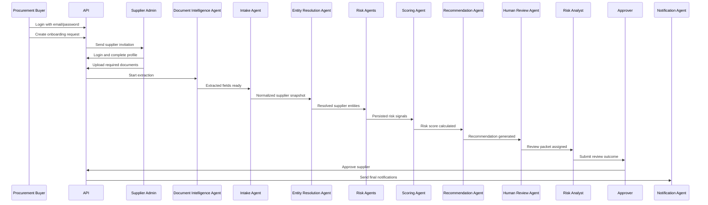

# Supplier Onboarding Sequence Flows

## Objective

This document defines the end-to-end sequence of events for onboarding one supplier. It shows how the application flow starts, which actor or system component is actionable at each step, and how the workflow changes across common scenarios.

The MVP assumes:

- Login is through email and password.
- Buyers can only see suppliers linked to them.
- Supplier users can only see suppliers explicitly mapped to them.
- AI agents can recommend, summarize, extract, enrich, score, and route.
- Final onboarding decisions must be made by authorized human users.

## Actors

| Actor | Responsibility |
|---|---|
| Procurement Buyer | Starts onboarding and tracks supplier status |
| Supplier Admin | Completes supplier profile, uploads documents, responds to clarification requests |
| Intake Agent | Normalizes submitted supplier data |
| Document Intelligence Agent | Classifies documents and extracts fields |
| Entity Resolution Agent | Resolves supplier identity, aliases, directors, UBOs, and relationships |
| Risk Agents | Run compliance, financial, ESG, cyber, reputation, logistics, authenticity, and anomaly checks as configured |
| Scoring Agent | Calculates deterministic category and composite scores |
| Recommendation Agent | Creates advisory recommendation |
| Human Review Agent | Prepares review packet and routes work |
| Risk Analyst | Reviews overall findings and category-specific evidence across compliance, financial, ESG, cyber, operational, reputation, authenticity, and anomaly risk |
| Approver / Risk Committee | Makes final approve, reject, defer, or enhanced due diligence decision |
| Notification Agent | Sends in-app and email notifications |
| Auditor | Reviews historical evidence, decisions, and audit trail |

## Core Status Values

### Onboarding Request Status

```json
[
  "draft",
  "submitted",
  "in_assessment",
  "needs_information",
  "in_review",
  "pending_approval",
  "enhanced_due_diligence",
  "approved",
  "rejected",
  "deferred"
]
```

### Supplier Status

```json
[
  "draft",
  "pending_onboarding",
  "pending_review",
  "pending_approval",
  "approved",
  "rejected",
  "archived"
]
```

### Action Ownership Pattern

Every step should have exactly one current owner:

```text
Buyer action
→ Supplier action
→ System or agent action
→ Analyst action
→ Approver action
→ System notification and audit action
```

## Main Happy Path: Supplier Approved

This is the standard successful onboarding sequence.

| Step | Current Owner | Event | System Action | Next Owner |
|---:|---|---|---|---|
| 1 | Procurement Buyer | Buyer logs in with email/password | API validates credentials and loads buyer roles, permissions, and supplier visibility scope | Procurement Buyer |
| 2 | Procurement Buyer | Buyer creates supplier onboarding request | Create `suppliers`, `onboarding_requests`, audit event, and buyer-supplier access mapping | Procurement Buyer |
| 3 | Procurement Buyer | Buyer enters initial supplier details and sends invitation | Create supplier contact, create or link Supplier Admin user, create supplier-user access mapping, return default login details when a new supplier user is created, send notification | Supplier Admin |
| 4 | Supplier Admin | Supplier Admin logs in with email/password | API validates supplier user and supplier access mapping | Supplier Admin |
| 5 | Supplier Admin | Supplier completes supplier profile | Save profile fields, update onboarding request, write audit event | Supplier Admin |
| 6 | Supplier Admin | Supplier uploads required documents | Store files in object storage, save document metadata, create audit events | Document Intelligence Agent |
| 7 | Document Intelligence Agent | Document extraction starts | OCR, classify documents, extract fields, persist extracted fields | Intake Agent |
| 8 | Intake Agent | Intake normalization starts | Normalize form and extracted data into supplier snapshot | Entity Resolution Agent |
| 9 | Entity Resolution Agent | Entity resolution starts | Resolve legal entity, aliases, directors, UBOs, and relationships | Risk Agents |
| 10 | Risk Agents | Enrichment starts | Run configured compliance, financial, news, ESG, cyber, logistics, authenticity, and anomaly checks | Scoring Agent |
| 11 | Scoring Agent | Scoring starts | Calculate category scores, composite score, and risk level from persisted risk signals | Recommendation Agent |
| 12 | Recommendation Agent | Recommendation starts | Create advisory recommendation with evidence-linked rationale | Human Review Agent |
| 13 | Human Review Agent | Review packet generation starts | Create review packet and route to correct reviewer or approver | Risk Analyst |
| 14 | Risk Analyst | Analyst reviews findings | Accept, dismiss, comment on findings, or request supplier clarification if needed; when all active findings are resolved, close Risk Analyst queue item, set supplier and onboarding status to `pending_approval`, notify buyer, and create Approver queue item | Approver / Risk Committee |
| 15 | Approver / Risk Committee | Approver reviews packet | Make final approve decision with reason | Notification Agent |
| 16 | Notification Agent | Final decision notification starts | Notify buyer and supplier, update supplier status to approved, write audit events | Workflow complete |

### Happy Path Sequence Diagram



## Detailed MVP Flow

### 1. Buyer Starts Onboarding

Owner: Procurement Buyer

Buyer actions:

- Logs in using email and password.
- Opens supplier onboarding page.
- Creates a new onboarding request.
- Enters initial supplier name, country, category, business unit, and expected spend.
- Adds supplier contact email.
- Sends supplier invitation.

System actions:

- Validates buyer credentials.
- Loads buyer permissions.
- Creates supplier record in `draft` or `pending_onboarding` status.
- Creates onboarding request in `draft` status.
- Creates buyer visibility mapping in `buyer_supplier_access`.
- Creates supplier contact record.
- Creates a Supplier Admin user when the supplier contact email does not already exist.
- Assigns the `Supplier Admin` role in `user_roles`.
- Creates supplier visibility mapping in `supplier_user_access`.
- Sends invitation to supplier contact.
- Returns supplier login details in the create onboarding response for newly created supplier users.
- If the supplier contact email already exists, links the existing user to the supplier and does not expose or reset the existing password.
- Writes audit events.

Next owner: Supplier Admin

Supplier invitation response contract:

```json
{
  "supplier_id": "SUP-12345678",
  "invitation": {
    "status": "created",
    "supplier_user_id": "USR-1234567890",
    "email": "supplier.admin@example.com",
    "role": "Supplier Admin",
    "supplier_id": "SUP-12345678",
    "login_url": "/auth/login",
    "password_delivery": "default_password",
    "default_password": "Password123!"
  }
}
```

Supplier login rules:

- New supplier users log in with the supplier contact email and the default password `Password123!`.
- The default password is only stored as a password hash in the database.
- Existing supplier users continue using their existing password.
- Supplier visibility is always enforced through `supplier_user_access`; a Supplier Admin can only open supplier records explicitly mapped to their user.

### 2. Supplier Completes Profile

Owner: Supplier Admin

Supplier actions:

- Logs in using email and password.
- Opens only the supplier record mapped to them.
- Completes required profile fields.
- Adds contacts, tax ID, registration number, address, website, and business metadata.
- Submits profile data.

System actions:

- Validates supplier access through `supplier_user_access`.
- Saves supplier profile.
- Updates onboarding request progress.
- Writes audit event for submitted profile changes.

Next owner: Supplier Admin

### 3. Supplier Uploads Documents

Owner: Supplier Admin

Supplier actions:

- Uploads required documents.
- Replaces incorrect files if needed.
- Submits document checklist.

System actions:

- Stores raw documents outside SQLite.
- Saves document metadata in SQLite.
- Creates document versions.
- Updates document checklist status.
- Creates extraction jobs.
- Writes audit events.

Next owner: Document Intelligence Agent

### 4. Document Extraction and Intake Normalization

Owner: System agents

Agent actions:

- Document Intelligence Agent classifies documents.
- Document Intelligence Agent runs OCR and extracts fields.
- Intake Agent combines form data and extracted fields.
- Intake Agent flags missing or low-confidence fields.

System actions:

- Stores extracted fields.
- Stores OCR output and agent artifacts.
- Updates extraction job status.
- Writes agent run records, tool calls, warnings, and audit events.

Next owner:

- Entity Resolution Agent if data is sufficient.
- Supplier Admin if required data is missing.

### 5. Entity Resolution

Owner: Entity Resolution Agent

Agent actions:

- Resolves legal name and registration identifiers.
- Checks aliases, branches, parent companies, subsidiaries, directors, and UBOs.
- Creates candidate matches and relationship records.
- Flags identity mismatch risk signals if needed.

System actions:

- Persists entity matches.
- Persists evidence sources.
- Persists relationship records.
- Writes audit events.

Next owner: Risk Agents

### 6. Risk Enrichment

Owner: Risk Agents

Agent actions:

- Sanctions and Compliance Agent checks sanctions, watchlists, regulatory notices, policy exclusions, and legal records.
- Financial Risk Agent checks financial distress, credit, bankruptcy, and payment signals.
- News and Reputation Agent checks adverse media and controversy velocity.
- ESG Risk Agent checks ESG controversies and certificates when configured.
- Authenticity Agent checks document tampering and certificate consistency when configured.
- Anomaly Agent checks unusual document, ownership, profile, or behavior patterns when configured.

System actions:

- Stores evidence sources and snapshots.
- Stores risk signals.
- Stores tool call records.
- Writes audit events.

Next owner: Scoring Agent

### 7. Scoring and Recommendation

Owner: Scoring Agent and Recommendation Agent

Agent actions:

- Scoring Agent loads active scoring policy.
- Scoring Agent calculates category and composite scores.
- Recommendation Agent creates advisory recommendation.

System actions:

- Persists risk score.
- Persists score components.
- Persists recommendation.
- Writes audit events.

Next owner:

- Approver directly if low risk and policy allows simplified review.
- Risk Analyst if medium, high, critical, or any material finding exists.

### 8. Human Review

Owner: Risk Analyst

Analyst actions:

- Reviews score, risk signals, evidence, extracted facts, and AI interpretation.
- Accepts or dismisses findings with reason.
- Reviews compliance, finance, ESG, cyber, operational, reputation, authenticity, and anomaly findings in one risk review workflow.
- Requests supplier relationship manager input if operational remediation context is needed.
- Requests supplier clarification when data is incomplete.
- Sends review outcome to approver.

System actions:

- Updates review queue status.
- Writes audit events for finding acceptance or dismissal.
- Creates clarification requests if needed.
- Sends notifications.

Next owner:

- Supplier Admin if clarification is required.
- Approver / Risk Committee if ready for final decision.

### 9. Final Decision

Owner: Approver / Risk Committee

Approver actions:

- Reviews final packet.
- Makes one of these decisions:

```json
[
  "approve",
  "reject",
  "defer",
  "request_information",
  "enhanced_due_diligence"
]
```

System actions:

- Saves decision with reason.
- Updates onboarding request status.
- Updates supplier status.
- Writes immutable audit event.
- Sends notifications to buyer and supplier.

Next owner:

- Workflow complete if approved or rejected.
- Supplier Admin if more information is required.
- Risk Analyst if enhanced due diligence is required.

## Scenario 1: Missing Required Information

This scenario occurs when supplier profile fields or required documents are missing.

| Step | Owner | Event | Outcome |
|---:|---|---|---|
| 1 | Supplier Admin | Submits incomplete profile or document checklist | System validates required fields |
| 2 | Intake Agent / Document Intelligence Agent | Detects missing or low-confidence data | Creates warning and missing field list |
| 3 | System | Creates clarification request | Onboarding status becomes `needs_information` |
| 4 | Notification Agent | Notifies Supplier Admin | Supplier Admin becomes next owner |
| 5 | Supplier Admin | Provides missing data or uploads replacement document | Status returns to `submitted` or `in_assessment` |
| 6 | Agents | Re-run impacted extraction, intake, entity, and scoring steps | Workflow continues |

Sequence:

```text
Supplier submits incomplete data
→ Intake or Document Agent detects gap
→ Clarification request created
→ Supplier notified
→ Supplier responds
→ Agents reprocess affected data
→ Risk assessment resumes
```

## Scenario 2: Low-Risk Supplier

This scenario applies when no material risk signals are found and the score is low.

| Step | Owner | Event | Outcome |
|---:|---|---|---|
| 1 | Agents | Enrichment completes with no material findings | Risk signals are empty or low severity |
| 2 | Scoring Agent | Calculates score between 0 and 39 | Risk level is `low` |
| 3 | Recommendation Agent | Recommends onboarding | Recommendation remains advisory |
| 4 | Human Review Agent | Creates simplified review packet | Routes to approver or configured low-risk queue |
| 5 | Approver | Approves supplier | Supplier becomes `approved` |

Important rule:

```text
Even low-risk suppliers require final human approval.
```

## Scenario 3: Medium-Risk Supplier

This scenario applies when score is between 40 and 69, or moderate findings require review.

| Step | Owner | Event | Outcome |
|---:|---|---|---|
| 1 | Scoring Agent | Calculates medium risk score | Status moves to `in_review` |
| 2 | Recommendation Agent | Recommends human review | Review packet created |
| 3 | Risk Analyst | Reviews findings and evidence | Analyst accepts, dismisses, or requests more data |
| 4 | Approver | Makes final decision | Approve, defer, reject, or request information |

Common outcomes:

```json
[
  "approve_with_notes",
  "request_information",
  "enhanced_due_diligence",
  "reject"
]
```

## Scenario 4: High or Critical Compliance Risk

This scenario applies when sanctions, watchlist, legal, or regulatory checks find a high-risk candidate match.

| Step | Owner | Event | Outcome |
|---:|---|---|---|
| 1 | Sanctions and Compliance Agent | Finds high or critical candidate match | Creates compliance risk signal |
| 2 | Notification Agent | Notifies Risk Analyst | Risk Analyst becomes next owner |
| 3 | Risk Analyst | Reviews match details and evidence | Confirms, dismisses, or escalates |
| 4 | Risk Analyst | Updates review packet | Adds compliance outcome |
| 5 | Approver / Risk Committee | Reviews critical finding | Rejects, blocks, defers, or requires executive approval |

Important rule:

```text
AI can recommend reject or block, but cannot make the final rejection decision.
```

## Scenario 5: Document Authenticity Issue

This scenario applies when a document appears suspicious or inconsistent.

| Step | Owner | Event | Outcome |
|---:|---|---|---|
| 1 | Authenticity Agent | Detects tampering, metadata mismatch, or certificate inconsistency | Creates authenticity finding |
| 2 | System | Pauses normal onboarding progression | Status moves to `in_review` or `enhanced_due_diligence` |
| 3 | Risk Analyst | Reviews document and evidence | Accepts, dismisses, or requests replacement |
| 4 | Supplier Admin | Uploads replacement if requested | Document extraction and authenticity check re-run |
| 5 | Approver | Makes final decision | Approve, reject, defer, or enhanced due diligence |

Sequence:

```text
Document uploaded
→ Authenticity Agent flags issue
→ Analyst reviews evidence
→ Supplier may replace document
→ Agents reprocess
→ Approver decides
```

## Scenario 6: Supplier Clarification After Analyst Review

This scenario applies when analyst review finds unresolved questions.

| Step | Owner | Event | Outcome |
|---:|---|---|---|
| 1 | Risk Analyst | Finds unclear evidence or missing explanation | Creates clarification request |
| 2 | Notification Agent | Notifies Supplier Admin | Supplier Admin becomes next owner |
| 3 | Supplier Admin | Responds with explanation or updated files | Response stored and audited |
| 4 | Agents | Re-run affected checks | Updated risk signals and scores are generated |
| 5 | Risk Analyst | Reviews updated packet | Routes to approver |

Important rule:

```text
Clarification requests and responses must be visible in the audit trail.
```

## Scenario 7: Score Override

This scenario applies when authorized reviewers believe the deterministic score requires override.

| Step | Owner | Event | Outcome |
|---:|---|---|---|
| 1 | Risk Analyst or authorized user | Reviews score components | Determines override is required |
| 2 | User | Enters override score and reason | System validates permission and reason |
| 3 | System | Saves score override | Audit event is written |
| 4 | Recommendation Agent | Regenerates recommendation using override context | Updated recommendation created |
| 5 | Approver | Reviews original score, override, and reason | Makes final decision |

Important rule:

```text
Score overrides must require a reason and must never erase the original score.
```

## Scenario 8: Supplier Rejected

This scenario applies when final human review determines the supplier should not be onboarded.

| Step | Owner | Event | Outcome |
|---:|---|---|---|
| 1 | Approver / Risk Committee | Reviews final packet | Reject decision selected |
| 2 | Approver / Risk Committee | Provides rejection reason | Decision saved |
| 3 | System | Updates supplier and onboarding statuses | Supplier becomes `rejected` |
| 4 | Notification Agent | Notifies buyer and supplier according to policy | Workflow complete |
| 5 | Audit Service | Records decision and evidence references | Audit trail complete |

Important rule:

```text
Rejection must be a human decision with reason and evidence references.
```

## Scenario 9: Supplier Deferred

This scenario applies when the business is not ready to approve or reject.

| Step | Owner | Event | Outcome |
|---:|---|---|---|
| 1 | Approver | Selects defer | Decision reason required |
| 2 | System | Updates onboarding status to `deferred` | Supplier remains pending |
| 3 | Notification Agent | Notifies buyer | Buyer becomes next owner if follow-up is needed |
| 4 | Buyer / Risk Analyst | Reopens or cancels later | Workflow resumes or closes |

Common defer reasons:

```json
[
  "awaiting_business_need",
  "awaiting_supplier_response",
  "awaiting_contract_review",
  "awaiting_enhanced_due_diligence"
]
```

## Scenario 10: Approved Supplier Enters Monitoring

This scenario starts after supplier approval.

| Step | Owner | Event | Outcome |
|---:|---|---|---|
| 1 | Approver | Supplier approved | Supplier status becomes `approved` |
| 2 | Monitoring Service | Creates monitoring subscription if policy requires it | Monitoring starts |
| 3 | Monitoring Agent | Runs scheduled or event-driven checks | New risk events may be detected |
| 4 | Scoring Agent | Recalculates score if material event occurs | Score movement stored |
| 5 | Notification Agent | Notifies assigned owner when threshold is crossed | Case may be opened |
| 6 | Supplier Relationship Manager / Risk Analyst | Reviews event and mitigation | Updates supplier posture |

Sequence:

```text
Supplier approved
→ Monitoring subscription created
→ Monitoring Agent checks configured sources
→ Material event detected
→ Risk score recalculated
→ Owner notified
→ Case opened if required
```

## Role-Based First Screens

After login, users should land on the screen that matches their role and current actionable work.

| Role | First Screen | Shows |
|---|---|---|
| Supplier Admin | Supplier portal | Assigned supplier profile, document checklist, clarification requests, onboarding status |
| Procurement Buyer | Buyer dashboard | Only linked suppliers, onboarding requests, pending supplier actions, final status |
| Risk Analyst | Review queue | Assigned reviews, supplier risk packets, category findings, pending analyst actions |
| Supplier Relationship Manager | Supplier portfolio | Approved suppliers assigned to them, monitoring events, open cases |
| Approver / Risk Committee | Approval queue | Suppliers ready for final decision |
| System Administrator | Admin console | Users, roles, permissions, providers, scoring policies, notification policies |
| Auditor | Audit console | Read-only audit trail, evidence history, decision history, score movement |

## Actionable Work Queue Rules

The application should always make the next actionable owner clear.

| Condition | Next Owner |
|---|---|
| Buyer has not sent invitation | Procurement Buyer |
| Supplier profile incomplete | Supplier Admin |
| Required documents missing | Supplier Admin |
| Documents uploaded but not extracted | Document Intelligence Agent |
| Extracted data incomplete or low confidence | Supplier Admin or Risk Analyst |
| Entity resolution pending | Entity Resolution Agent |
| Risk enrichment pending | Risk Agents |
| Scoring pending | Scoring Agent |
| Recommendation pending | Recommendation Agent |
| Review packet pending | Human Review Agent |
| Medium or high findings unresolved | Risk Analyst |
| Compliance finding unresolved | Risk Analyst |
| Financial finding unresolved | Risk Analyst |
| ESG finding unresolved | Risk Analyst |
| Cyber finding unresolved | Risk Analyst |
| All active findings accepted or dismissed | Approver / Risk Committee |
| Final decision pending | Approver / Risk Committee |
| Supplier approved and monitoring enabled | Monitoring Agent |
| Monitoring threshold crossed | Supplier Relationship Manager or Risk Analyst |

## Audit Events by Flow Stage

Every material step should emit an audit event.

| Stage | Example Audit Actions |
|---|---|
| Login | `auth.login_succeeded`, `auth.login_failed` |
| Buyer onboarding | `onboarding.created`, `supplier.created`, `supplier_access.buyer_assigned` |
| Supplier invitation | `supplier.invitation_sent` |
| Supplier profile | `supplier.profile_updated`, `supplier.profile_submitted` |
| Documents | `document.uploaded`, `document.replaced`, `document.extraction_completed` |
| Agents | `agent.run_started`, `agent.run_completed`, `agent.run_failed` |
| Evidence | `evidence.created`, `risk_signal.created` |
| Scoring | `score.calculated`, `score.override_created` |
| Review | `review.assigned`, `finding.accepted`, `finding.dismissed` |
| Clarification | `clarification.requested`, `clarification.responded` |
| Decision | `decision.approved`, `decision.rejected`, `decision.deferred`, `decision.request_information` |
| Monitoring | `monitoring.subscription_created`, `risk_event.detected`, `case.created` |

## End-to-End Definition of Done

One supplier onboarding flow is complete when:

- Buyer can create and track only linked supplier onboarding requests.
- Supplier Admin can access only their mapped supplier record.
- Supplier profile and required documents are submitted.
- Agents complete extraction, normalization, entity resolution, enrichment, scoring, recommendation, and review packet generation.
- Material findings have evidence references.
- Human reviewers can accept, dismiss, or request clarification.
- Final approver makes a decision with reason.
- Buyer and supplier are notified.
- Audit trail can reconstruct every user action, agent action, evidence item, score, recommendation, and decision.
