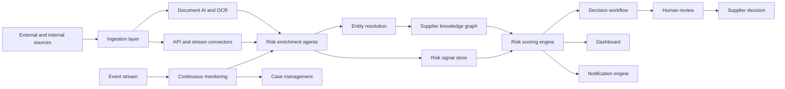

# Technical Architecture and Tech Stack

## Target Architecture

## Recommended Tech Stack

| Layer | Recommended Options |
|---|---|
| Frontend | React / Next.js, TypeScript, Tailwind CSS, shadcn/ui |
| Charts and Visualization | Recharts, Apache ECharts, D3.js for graph-heavy views |
| Backend APIs | Python FastAPI or Node.js/NestJS |
| Agent Orchestration | OpenAI Agents SDK, LangGraph, Semantic Kernel |
| Workflow Engine | Temporal for durable onboarding, review, and escalation workflows |
| Event Streaming | Kafka, Redpanda, AWS MSK, Azure Event Hubs |
| Async Processing | Temporal workers, Celery, BullMQ |
| LLM Layer | OpenAI models with tool calling, structured outputs, and guardrails |
| OCR and Document AI | Azure Document Intelligence, AWS Textract, Google Document AI, Tesseract fallback |
| Transactional Database | PostgreSQL |
| Vector Search | pgvector, Pinecone, Weaviate, OpenSearch vector search |
| Graph Database | Neo4j or Amazon Neptune |
| Search | OpenSearch / Elasticsearch |
| Object Storage | S3, Azure Blob Storage, Google Cloud Storage |
| Rules and Policy Engine | JSONLogic, Drools, Open Policy Agent, custom scoring service |
| BI and Reporting | Superset, Metabase, Power BI integration |
| Observability | OpenTelemetry, Prometheus, Grafana, model tracing |
| Security | SSO, SAML/OIDC, RBAC, encryption, secrets manager, audit logs |

## Core Services

| Service | Purpose |
|---|---|
| Supplier Service | Supplier master profile, status, ownership, business metadata |
| Document Service | Uploads, OCR status, extraction results, authenticity checks |
| Enrichment Service | External source ingestion and normalized risk signals |
| Entity Resolution Service | Identity matching, aliases, UBOs, relationship mapping |
| Scoring Service | Risk score computation, thresholds, score history |
| Workflow Service | Human review, approvals, escalations, reassessments |
| Monitoring Service | Continuous monitoring jobs and event subscriptions |
| Notification Service | In-app, email, Teams/Slack, webhook, SMS alerts |
| Case Management Service | Investigation, remediation, SLA, closure |
| Audit Service | Immutable decision and evidence trail |

## Data Stores

| Store | Data |
|---|---|
| PostgreSQL | Supplier profiles, users, cases, decisions, scores |
| Object Storage | Raw documents, extracted files, evidence snapshots |
| Vector Database | Embeddings for document search and semantic retrieval |
| Graph Database | Supplier relationships, UBO links, parent/subsidiary mapping |
| Search Index | News, documents, evidence, investigation notes |
| Event Store | Risk events, score changes, alert history |

